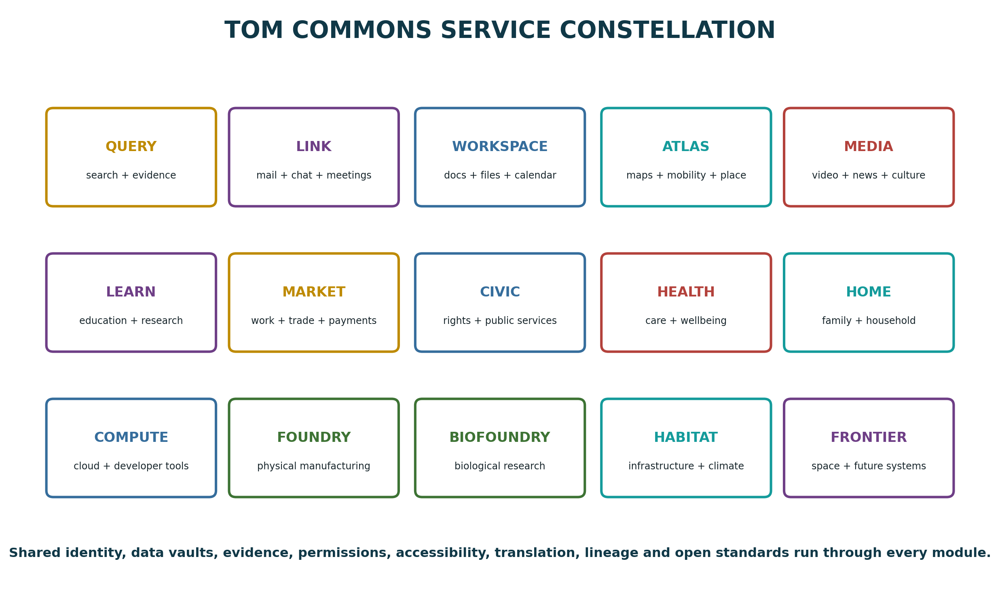
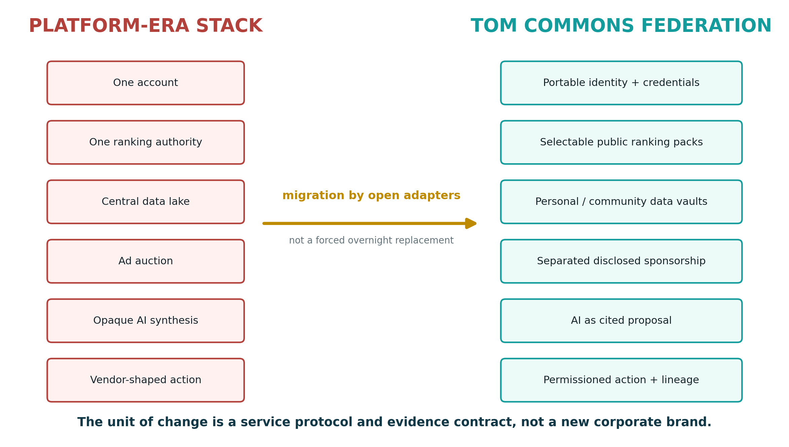
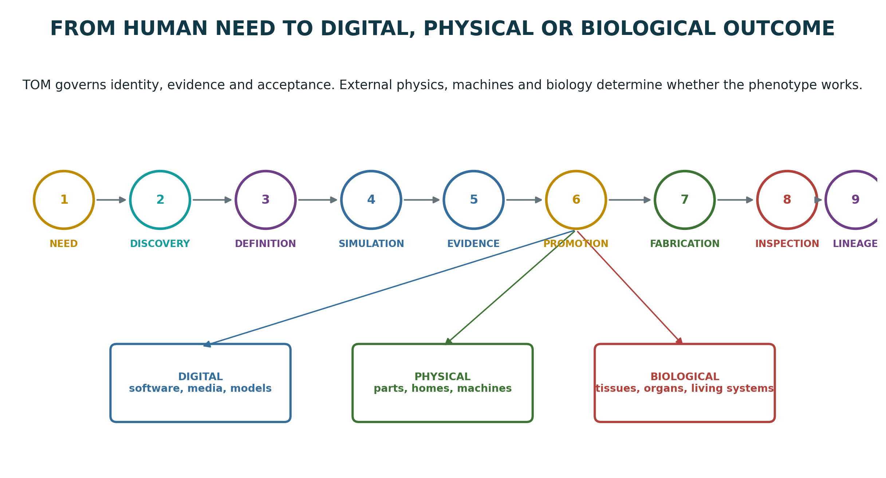
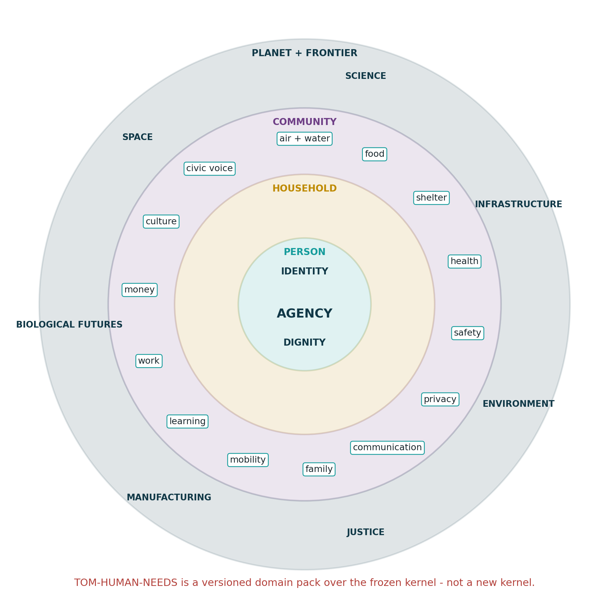
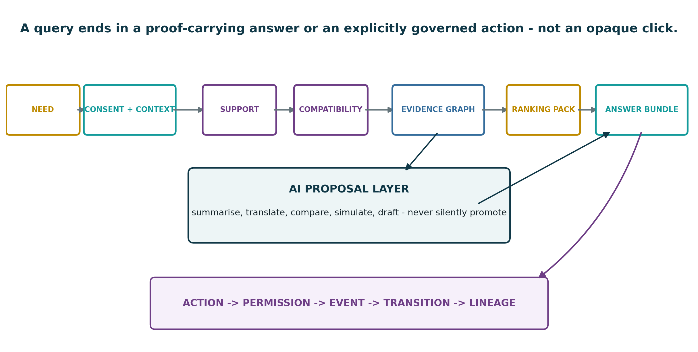
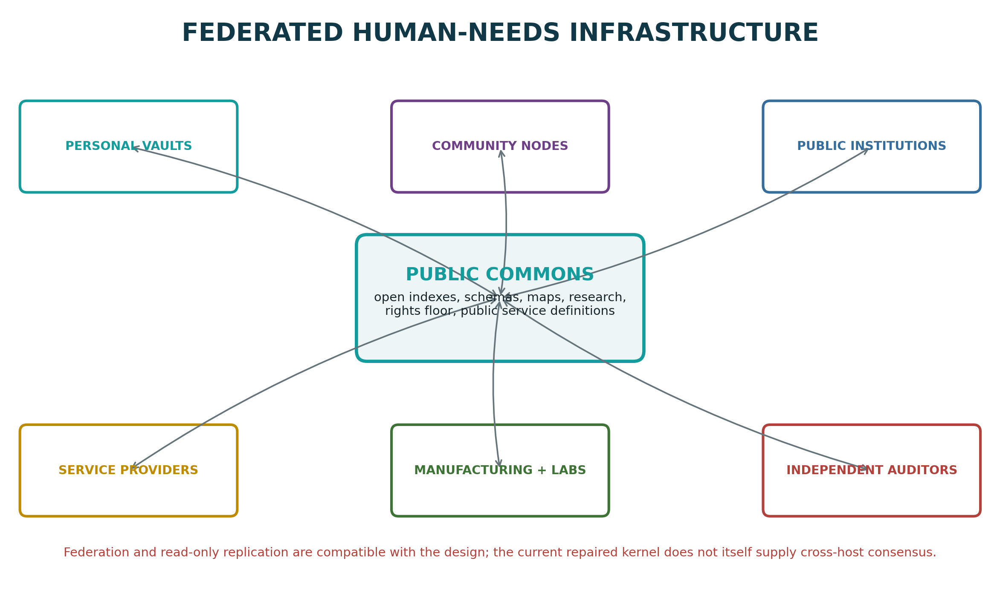
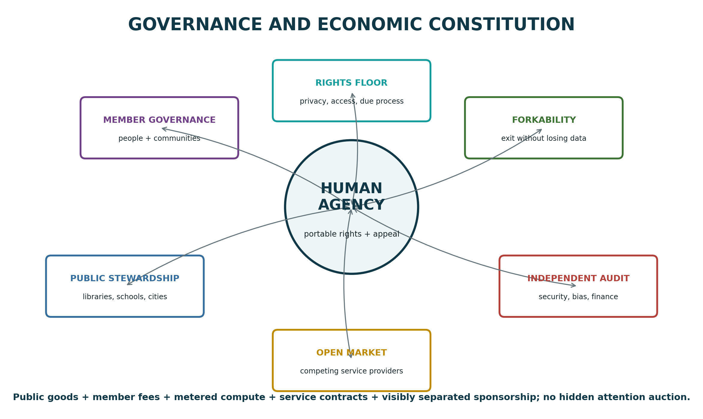
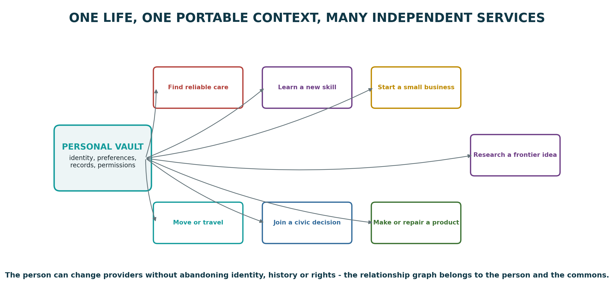
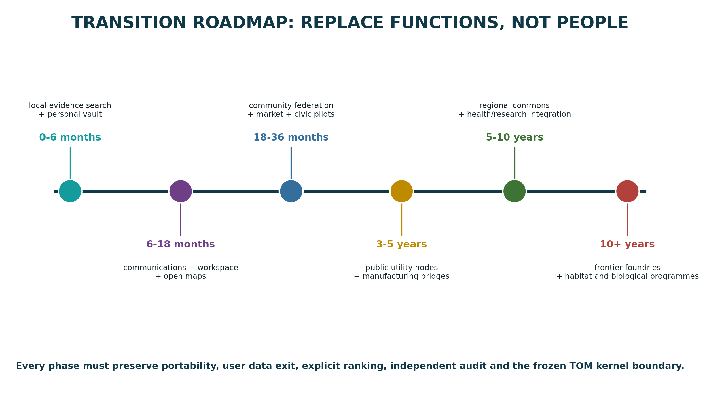

\thispagestyle{empty}
\begin{center}
\vspace*{10mm}
{\Huge\bfseries\sffamily\textcolor{tomnavy}{TOM Commons}}\\[3mm]
{\LARGE\sffamily\textcolor{tomteal}{The Human-Needs Discovery, Coordination and Manufacturing Network}}\\[7mm]
{\large\sffamily A new type of Google beyond platform lock-in - search, communication, AI, maps, public services, markets, science, manufacturing and life infrastructure}\\[7mm]
\rule{0.89\textwidth}{1.2pt}\\[7mm]
\includegraphics[width=0.82\textwidth]{figures/cover_constellation.png}\\[7mm]
{\large\sffamily Tom Klootwijk}\\[1.5mm]
Requester-supplied attribution: 10-07-1990 | NL200678942\\[1.5mm]
3 September 2026\\[6mm]
\begin{minipage}{0.88\textwidth}
\small
This is a systems architecture, civic design and research horizon report. It is not affiliated with, endorsed by, or a product of Google or Alphabet. "Google" is used descriptively to identify a present-day family of discovery, communication, productivity, media, map, cloud and AI functions that this proposal seeks to replace through open protocols and human-governed services.
\end{minipage}
\end{center}

\newpage
\thispagestyle{plain}
\section*{Document status, interpretation and evidence boundary}

This report accompanies **TOM Manufacturing Horizons: From a Frozen Deterministic Kernel to Frontier Physical, Biochemical and Biological Fabrication**. The earlier report asked what could eventually be designed, simulated, manufactured or grown. This companion asks a different question: **what social and digital operating system would let people discover those possibilities, govern them, learn from them, coordinate them and turn them into dignified outcomes?**

The proposal is called **TOM Commons**. It is not one replacement corporation, one search box, one AI model or one universal database. It is a federated human-needs network in which identity, evidence, ranking, communication, services, fabrication and lineage can be separated, independently operated and recombined under explicit rules.

\begin{boundarybox}
TOM Commons is a blueprint, not a deployed Google-scale service and not evidence of AGI. The current TOM materials demonstrate a deterministic seeded execution substrate, bounded formal learning families, exact promotion authority and reproducible artifacts within stated limits. They do not demonstrate global web crawling, distributed consensus, universal knowledge, safe autonomous medicine, global governance, biological manufacturing at scale or replacement of existing institutions.
\end{boundarybox}

\begin{constitutionbox}
The user's description of present institutions as "cave-men and women" is interpreted here as an urgent critique of obsolete coordination mechanisms, opaque ranking, account silos, brand lock-in, advertising incentives, duplicated bureaucracy and weak user agency. It is not adopted as a judgement on the intelligence or worth of any person, profession, culture or gender. The system is designed to replace primitive *institutional interfaces*, not to demean or discard people.
\end{constitutionbox}

\begin{tomprinciple}
The canonical TOM seed and fixed TOMAGI kernel remain unchanged. "TOM-HUMAN-NEEDS" is a proposed, versioned domain pack above the frozen substrate. Search, maps, health, markets, public services, manufacturing and biological futures are expressed through content-addressed definitions, external standards adapters and independently testable services - not new kernel opcodes.
\end{tomprinciple}

\textbf{Claim classes used throughout.}

| Class | Meaning |
|---|---|
| **Existing foundation** | A standard, dataset, protocol or TOM mechanism already exists and is cited. |
| **Near-term engineering** | Buildable with present hardware and open software, but not delivered by this report. |
| **Institutional transition** | Technically plausible but dependent on governance, adoption, law and sustained funding. |
| **Frontier extension** | Physically plausible research direction inherited from the Manufacturing Horizons report. |
| **Unestablished** | Not supported as a current capability and explicitly not claimed. |

\vfill
\begin{center}
\small\sffamily
Canonical TOM seed: 244 ASCII bytes, no terminal newline\\
SHA-256: \texttt{d1417a3136772c0cf3eddcd4962ce07d42cbf87616f7b5bae09fc652d9b807b5}\\[3mm]
Prepared 3 September 2026
\end{center}

\newpage
\section*{Request as received}

\begin{quote}
Create an accompanying .pdf of a new type of Google on all fronts of the latest manufacturing horizons .pdf document of the latest turns context, all facets of new Genome TOM human needs basically replacing Google and all facets of life that traditional AI and humans need in this prehistoric present day, as everything is gridlocked and held by cave- men and women that are trapped in their prehistoric symbols brands corporations etc. all facets of society is just deprecated and there is no evolutionary push available right now without TOM Genome (the replacement), make a large cohesive .pdf of all of my request
\end{quote}

\textbf{Design response.} The report answers the whole request by separating four ambitions that are often mixed together:

1. replacing the *functional surface* of a large platform ecosystem;
2. replacing an advertising-and-account business model with a human-needs and public-commons model;
3. extending discovery all the way to services, decisions, manufacturing and biological research;
4. creating an evolutionary path that can start on ordinary hardware without pretending that the complete global system already exists.

The result is deliberately larger than a search-engine proposal. It is a constitutional architecture for a human-centred information and action network.

\newpage
\tableofcontents
\newpage

# Executive synthesis

Google began as web search but now spans an unusually broad surface: search, AI assistance, browsers and operating systems, email, calendars, documents, storage, maps, travel, media, news, education, payments, business discovery, advertising, cloud infrastructure and developer platforms. Google's own product directory lists more than one hundred consumer, business and developer offerings across these categories. [G1] Alphabet's 2025 filing reported $402.836 billion in total revenue, including $294.691 billion in Google advertising revenue, and stated that more than 70 per cent of total revenue came from online advertising. [G2] Those facts do not by themselves make Google harmful; they show why a serious functional alternative cannot be only another search interface.

The proposed replacement is not "one better corporation". Its governing sentence is:

\begin{tomprinciple}
\textbf{The new Google is a protocol federation, not a platform monopoly.} A person brings a portable identity, a personal data vault and a chosen rights profile. Independent services contribute search, maps, communication, media, education, markets, health, civic functions, manufacturing and computation. TOM supplies deterministic evidence, explicit ranking profiles, support, compatibility, decision, transition and lineage. AI supplies proposals and explanations, not invisible authority.
\end{tomprinciple}

A query in TOM Commons is not merely a string sent to an opaque ranking system. It is a typed declaration of need:

```text
need + person-selected context + consent + rights
-> eligible sources and services
-> support and compatibility filtering
-> evidence graph
-> visible ranking profile
-> cited AI proposal or deterministic answer
-> optional plan, transaction, service or fabrication request
-> permissioned event and transition
-> lineage receipt
```

The network is designed around **human outcomes** rather than attention. It must answer not only "what page matches these words?" but also:

- What do I need, what evidence is relevant, and which claims conflict?
- Which services am I eligible for, what will they cost, and what data must I share?
- Which route, course, job, treatment discussion, public process or supplier fits my declared constraints?
- Can I change provider without losing identity, history, documents, contacts or rights?
- Can an AI explain its source path without becoming the authority that approves itself?
- Can a design move from idea to simulation, certified manufacture, repair and recycling with one lineage?
- Can a future biological construct move from hypothesis to ethical research, measurement and regulated promotion without hiding uncertainty?

{width=94%}

The proposed **TOM-HUMAN-NEEDS-1.0** domain pack organises the network around survival, agency, development, belonging, collective life and future stewardship. It is explicitly not a change to the 244-byte canonical root. It is a versioned library of typed definitions over the frozen TOM substrate.

The near-term system can begin on a laptop using open foundations that already exist: community map data, collaborative structured knowledge, public research indexes, open web archives, federated communication, portable credentials, passkeys and user-controlled data stores. [W1-W10] The difficult work is therefore not discovering whether decentralised building blocks are imaginable. It is integrating them into one coherent rights-preserving experience, creating trustworthy public indexes, funding common infrastructure, defending it from capture and making migration easier than continued dependence on closed platforms.

The report's conclusion is neither "everything is solved" nor "nothing can change". It is:

> A credible post-platform network is technically constructible in stages today. TOM can provide its deterministic authority and evidence layer, but global scale, distributed governance, high-quality open indexes, safety, accessibility, institutional adoption and sustainable economics remain major engineering and political programmes.

# Part I - From platform search to human-needs infrastructure

# 1. What a "new type of Google" must actually replace

A simplistic replacement would copy a search box, index webpages and show links. That would cover only one visible surface. The current Google family includes a browser, mobile operating system, identity, email, messaging, meetings, files, office tools, maps, navigation, travel, video, music, books, photos, news, education, payments, shopping, business profiles, analytics, advertising, cloud infrastructure and developer services. [G1]

A complete functional alternative must therefore replace or interoperate with five deeper forms of power:

1. **Discovery power** - which sources, places, products, institutions and people can be found.
2. **Interpretation power** - which answer, summary or ranking is placed first and why.
3. **Identity power** - which account controls access to communication, files, devices and services.
4. **Transaction power** - how discovery becomes a purchase, booking, application, message, route, upload or action.
5. **Infrastructure power** - which cloud, app store, operating system, analytics and advertising rails other organisations depend on.

TOM Commons separates these powers. No search operator automatically owns identity; no identity provider automatically owns files; no file host automatically owns communication; no ranking provider automatically owns payment; no AI model automatically promotes its own answer; no physical manufacturer automatically owns the evidence standard that qualifies its product.

{width=92%}

## 1.1 Functional replacement, not brand imitation

The proposed modules use names such as TOM Query, TOM Link and TOM Atlas as architectural labels. They are not intended to imitate logos, trade dress or proprietary interfaces. A replacement succeeds when a person can accomplish the same or better outcome while retaining agency:

| Present function | Replacement test |
|---|---|
| Search | Can the person find sources, understand ranking, inspect conflicts and choose a different index? |
| Email and messaging | Can the person communicate across providers and keep identity and history when switching? |
| Maps and navigation | Can communities correct local data and can routing objectives be selected explicitly? |
| Documents and storage | Can files be edited collaboratively without surrendering their only usable copy to one vendor? |
| AI assistance | Can a model help without silently becoming the source of truth or action authority? |
| Video and news | Can creators publish and communities moderate without one recommendation engine owning reach? |
| Payments and commerce | Can a person compare offers and transact without hidden pay-to-rank placement? |
| Cloud and developer tools | Can applications move between operators and verify reproducible builds? |
| Public services | Can eligibility, evidence and appeals be explicit rather than scattered across portals? |
| Manufacturing | Can discovery proceed to a proof-carrying design, process and product? |

## 1.2 The platform-era model is advanced technology with primitive coordination

Calling the present "prehistoric" is best understood as a systems metaphor. Our processors, networks, scientific instruments and software are highly advanced. The primitive element is the coordination contract:

- people repeatedly recreate identity and context in separate account silos;
- data portability is usually partial and semantically weak;
- ranking objectives are rarely selected by the person receiving results;
- advertising and service discovery are deeply entangled;
- public services, healthcare, education and employment remain fragmented portals;
- institutions duplicate verification instead of exchanging portable evidence;
- AI systems can sound authoritative while obscuring uncertainty and source disagreement;
- manufacturing and research histories are commonly reduced to PDFs, spreadsheets and disconnected databases;
- changing provider often means losing history, social graph, audience or workflow.

The evolutionary push proposed here is not to eliminate symbols, brands or institutions. Humans need language, identity, trust and cultural continuity. The push is to make those representations **portable, contestable, evidence-bearing and subordinate to human needs**.

# 2. Why the business model matters

Alphabet's 2025 annual filing states that Google Services generates revenue primarily through performance and brand advertising on Search, YouTube and network properties, and that more than 70 per cent of total revenues came from online advertising. It also reports $224.532 billion in Google Search and other revenue, $40.367 billion in YouTube advertising, $29.792 billion from Google Network, $48.030 billion from subscriptions/platforms/devices and $58.705 billion from Google Cloud. [G2]

This matters because ranking, identity, measurement and commerce cannot be constitutionally separated if the infrastructure is financed mainly by predicting and influencing attention. TOM Commons does not prohibit advertising or commercial promotion. It changes its status:

```text
organic evidence result
!= sponsored placement
!= personal recommendation
!= public-service message
!= emergency alert
```

Each class must be visibly separated, machine-readable and queryable. Sponsorship may buy a labelled presentation slot; it may not secretly change the evidence score or masquerade as an independent recommendation.

## 2.1 A plural funding model

A universal human-needs network cannot depend on one revenue source. It needs a mixed economy:

| Funding rail | Appropriate use |
|---|---|
| Public funding | Core search indexes, maps, civic access, emergency information, accessibility and basic identity infrastructure |
| Member cooperative fees | Personal vaults, communication, community governance and support |
| Metered compute and storage | Large model inference, simulations, archival storage and high-volume enterprise use |
| Service subscriptions | Premium collaboration, professional tools, specialist data and managed operation |
| Transaction fees | Payments, bookings and markets, with transparent caps and competition |
| Institutional contracts | Schools, libraries, hospitals, cities, research organisations and manufacturers |
| Grants and philanthropy | Open datasets, underserved languages, safety research and early deployment |
| Disclosed sponsorship | Clearly separated promotional channels that cannot modify organic rankings |
| Data dividends or licensing | Only for explicitly consented collective data trusts, never covert extraction |

The system should let a local library operate a public query node, a university operate a research index, a cooperative operate personal data vaults, a city operate public-service definitions, a private company operate high-performance compute, and an independent foundation maintain interoperability tests.

# 3. The frozen TOM boundary

The supplied TOM-SRS defines a finite canonical string as a content-addressed root expanding into typed definitions, state, bounded grammar, relations, support, compatibility, guarded events, transitions and lineage. Its page-four diagram places optional AI, control, projection and hardware after the authoritative world and query evaluator. The TOMAGI reference machine fixes a 128-byte header, 64-byte state, 48-byte cell and sixteen opcodes. The CODEX repair handoff adds defined arithmetic, reserved-header rejection, bounded formal values, authenticated output and same-host publication locking. [T1-T4]

These materials impose three non-negotiable design rules.

## 3.1 Do not expand the kernel to add society

Search, healthcare, money, education or manufacturing do not become new opcodes. They become versioned domain definitions and external service contracts. The current kernel remains a deterministic substrate, not a growing monolith.

## 3.2 Formal authority, independent oracle, mechanical service

Every important decision must be assigned to one of three roles:

| Role | What it may do | What it may not do |
|---|---|---|
| Formal authority | Express definitions, ranking rules, permissions, eligibility, acceptance and promotion | Hide domain decisions in opaque host code |
| Independent oracle | Search, simulate, measure, calculate, classify or attempt to falsify | Promote its own output automatically |
| Mechanical service | Parse, hash, store, transport, execute, render, index and replicate | Decide truth, eligibility, safety or authority without a formal rule |

## 3.3 Current publication limitation

The repaired kernel coordinates publication writers on one host. It does not provide a global consensus protocol. TOM Commons may use federated communication and distributed read-only replication immediately, but cross-host authoritative publication needs a separately specified consensus, quorum or institutional signing layer. The report therefore distinguishes the *network architecture* from the *current kernel guarantee*.

# 4. Companion relationship to the Manufacturing Horizons report

The Manufacturing Horizons report describes proof-carrying software, factories, materials, biochemical systems, organs, engineered living materials, synthetic life research and planetary-scale manufacturing. This companion supplies the discovery and coordination layer around those futures.

The relation is:

```text
TOM Commons asks:
What is needed? What is known? Who can help? Which evidence is valid?
Which path is affordable, permitted and compatible?

TOM Manufacturing Horizons asks:
How can a verified design become software, hardware, material,
tissue, organ, living system, habitat or off-world infrastructure?
```

Together they describe a continuous chain from need to knowledge, decision, service, fabrication, inspection, operation, repair and lineage.

{width=95%}

# Part II - Genome TOM Human Needs

# 5. TOM-HUMAN-NEEDS-1.0 as a domain pack

"Genome TOM human needs" is defined here as a versioned domain pack, not a replacement for the canonical TOM genome. Its purpose is to give every ordinary and frontier request a typed place in the system.

```text
TOM-HUMAN-NEEDS-1.0 =
  needs taxonomy
+ rights and consent profile
+ person / household / community contexts
+ service and evidence schemas
+ ranking-profile registry
+ action and permission vocabulary
+ outcome, appeal and lineage records
```

A need record does not reduce a person to a marketing segment. It says what outcome is being sought, what constraints the person chooses to reveal, which rights apply, how urgent the situation is, and whether the request should remain local, be shared with a community or enter a public network.

## 5.1 Six layers of human need

{width=82%}

| Layer | Core domains | Example typed requests |
|---|---|---|
| Survival | air, water, food, shelter, health, physical safety | "Find safe drinking-water guidance for this location"; "show available shelter tonight" |
| Agency | identity, privacy, communication, mobility, money, legal capacity | "Prove my qualification without exposing my full history"; "move my files to another provider" |
| Development | learning, work, science, creativity, tools | "Build a verified learning path"; "find work compatible with my skills and care duties" |
| Belonging | family, friendship, community, culture, language, recreation | "Find a local group I can join safely"; "preserve this community archive" |
| Collective life | civic participation, justice, infrastructure, environment, public health | "Explain this policy and show its evidence"; "report a broken public asset" |
| Frontier stewardship | manufacturing, biological research, habitat, space, long-term survival | "Trace this design to a repairable product"; "compare organ-manufacturing research pathways" |

These layers are not a hierarchy of human worth. They are a routing model. A single request may touch several domains: finding a home can involve money, work, mobility, education, family, healthcare and law. The system must preserve this overlap rather than forcing the person into one departmental portal.

## 5.2 Need records

A canonical request could contain:

```json
{
  "type": "tom.need.request",
  "need": "stable_housing",
  "requested_outcome": "eligible options with total monthly cost below declared ceiling",
  "urgency": "within_30_days",
  "location_scope": "chosen region",
  "constraints": ["wheelchair_accessible", "near_transit"],
  "disclosure_policy": "minimum necessary",
  "ranking_profile": "public-benefit-housing-v1",
  "action_authority": "human_confirmation_required"
}
```

The record says nothing about a person's value, personality or hidden probability of conversion. It exposes only what is necessary for the selected task.

## 5.3 Rights are part of the query type

Every query must carry a rights profile, not merely a terms-of-service checkbox. At minimum:

- access without discriminatory exclusion;
- understandable reasons for ranking and rejection;
- data minimisation and purpose limitation;
- provider portability;
- ability to inspect and correct personal records;
- human review for consequential decisions;
- an appeal path;
- accessible and multilingual presentation;
- protection against covert sponsored ranking;
- special safeguards for children, health, finance, employment and public services;
- the right to use basic public functions without behavioural advertising;
- the right to leave without losing one's social graph, documents or credentials.

The Universal Declaration of Human Rights is not a software specification, but it provides a useful normative floor for dignity, privacy, expression, association, education, work, public participation and social protection. [H1] Digital public infrastructure programmes similarly emphasise identity, payments, data exchange, governance and safeguards as public-capability layers rather than isolated apps. [H2]

# 6. The core data model

TOM Commons requires a world model richer than webpages. The primary objects are:

| Object | Meaning |
|---|---|
| Person context | User-controlled attributes, preferences and permissions; stored in a chosen vault |
| Need | Desired outcome, urgency, scope, constraints and action authority |
| Claim | A statement by a source, with type, time, provenance and evidence links |
| Evidence | Observation, document, dataset, measurement, proof, test or authoritative record |
| Source | Publisher, institution, person, sensor, model, dataset or service |
| Service | A capability offered under explicit eligibility, cost, location and quality definitions |
| Resource | Place, document, product, course, job, benefit, appointment, machine or material |
| Relation | Typed connection among people, resources, claims, services and contexts |
| Ranking profile | Visible algorithm and weights used to order eligible results |
| Proposal | AI, human or algorithmic suggestion that is not yet authoritative |
| Decision | Accepted, rejected or ambiguous result under a declared rule set |
| Action | Message, booking, payment, application, route, fabrication order or publication |
| Outcome | Observed result after action, including failure and unintended effects |
| Appeal | Challenge to a ranking, decision, exclusion or record |
| Lineage | Immutable chain from input and definitions to result and later revision |

## 6.1 A result is an answer bundle

A TOM Commons result should contain more than a title and URL:

```text
answer or candidate
source identities
claim-evidence graph
publication and observation dates
known conflicts
applicable jurisdiction and scope
ranking components
personal-data fields used
AI transformations performed
confidence or uncertainty as explicit evidence
service availability and cost
required actions and permissions
appeal or correction route
replay and lineage identifier
```

This does not mean every casual query must display a wall of technical metadata. The interface can be simple by default. The difference is that the underlying receipt exists and can be expanded.

## 6.2 Evidence classes

| Class | Examples | Treatment |
|---|---|---|
| Primary observation | measurement, official filing, original dataset, direct testimony | Preserve exact source and conditions |
| Formal proof or test | theorem proof, software test, conformance result | Preserve executable inputs and verifier |
| Curated reference | encyclopedia, handbook, systematic review | Link its source basis and revision |
| Institutional claim | government notice, company statement, school or hospital record | Identify issuing authority and scope |
| Independent analysis | journalism, research interpretation, expert review | Separate facts, methods and conclusions |
| Community knowledge | local map correction, mutual-aid resource, practitioner experience | Preserve contributors, moderation and conflict |
| Model output | LLM response, forecast, simulation, classifier | Label as proposal or computed observation, never as self-validating truth |
| Sponsored claim | advertisement, promoted listing, paid creator placement | Separate channel, visible funding identity |

# 7. The query-to-outcome contract

{width=96%}

## 7.1 Step 1 - declare the need

The person may type, speak, show an image, select a life event or use a structured form. A language model can help translate the expression into candidate need records, but the person sees and can edit the interpreted request.

## 7.2 Step 2 - select context and consent

Context is drawn from the person's vault only under an explicit scope. A route query may use current location but not health history. A job query may use verified skills but not unrelated family communications. The query receipt records exactly which fields were accessed.

## 7.3 Step 3 - support filtering

Support removes items that are outside the task's declared region, time, domain, eligibility or availability. A service that does not operate in the chosen country or a product that is no longer available should not proceed to ranking.

## 7.4 Step 4 - compatibility filtering

Compatibility checks the person's explicit constraints and the service's declared capabilities. Examples include language, accessibility, technical interface, insurance, licence, budget, schedule, material, device or manufacturing-process compatibility.

## 7.5 Step 5 - evidence graph construction

The system retrieves source records and builds an explicit graph of claims, support, contradiction and derivation. A single result may have several sources that agree for different reasons; it may also carry a visible dispute.

## 7.6 Step 6 - visible ranking

The chosen ranking profile orders only the eligible set. The profile is versioned, inspectable and replaceable. A user may choose:

- public-interest default;
- local-community priority;
- newest reliable evidence;
- lowest total cost;
- strongest independent verification;
- accessibility-first;
- environmental impact;
- diversity of source or viewpoint;
- professional or institutional profile;
- self-authored weighted combination.

## 7.7 Step 7 - answer, plan or service transition

The terminal output can be:

- a factual answer with citations;
- a set of competing interpretations;
- a map or route;
- a communication thread;
- a document or media item;
- an application or booking plan;
- a purchase comparison;
- a verified software action;
- a public-service eligibility packet;
- a manufacturing or research proposal.

Any consequential action requires an explicit permission event. The action and resulting observation become lineage.

# 8. Ranking without invisible authority

The ranking problem cannot be abolished; it can only be governed. A global index may contain millions of eligible items. TOM Commons therefore makes ranking a first-class, contestable definition.

A ranking profile could specify:

```text
score =
  w1 * query relevance
+ w2 * evidence quality
+ w3 * source independence
+ w4 * recency fit
+ w5 * local availability
+ w6 * accessibility fit
+ w7 * total cost
+ w8 * repairability / durability
+ w9 * environmental impact
- w10 * unresolved contradiction
```

The exact implementation can differ by domain. What matters is that:

1. the factors and their source records are visible;
2. paid placement cannot alter an organic score silently;
3. the user can choose another profile;
4. public institutions can publish accountable profiles;
5. researchers can compare outcomes across profiles;
6. communities can fork a profile without forking the whole network;
7. consequential ranking changes require versioned publication and regression evidence.

## 8.1 Diversity without forced equivalence

Showing diverse sources does not mean treating every claim as equally supported. The system should distinguish:

- strong consensus;
- legitimate expert disagreement;
- political or ethical value conflict;
- incomplete evidence;
- disproven claims;
- manipulation or spam.

A diversity objective selects independent evidence paths or viewpoints after minimum quality and relevance conditions. It does not require placing harmful or unsupported claims beside well-established evidence as though the difference were merely preference.

## 8.2 Personalisation as a local, inspectable operation

Personalisation should occur as late and locally as possible. The public index returns an eligible evidence set; the person's chosen device or vault service applies preferences. The system records the fields and profile used. Sensitive traits are not inferred for advertising.

# 9. AI after the platform era

Traditional AI remains useful. It can translate, summarise, search, classify, extract, draft, simulate, write code, generate media, plan and propose. The architectural change is that an AI output has a typed status.

| AI output | Default status |
|---|---|
| Factual answer | Proposal linked to sources and retrieval receipt |
| Search query expansion | Mechanical proposal; original request retained |
| Translation | Derived representation linked to source text and model/version |
| Medical explanation | Educational proposal; not diagnosis or treatment authority |
| Legal explanation | Informational proposal; not legal decision authority |
| Code | Candidate artifact requiring tests and review |
| Plan | Candidate sequence requiring constraint and permission checks |
| Product design | Candidate definition requiring simulation and manufacturing evidence |
| Scientific hypothesis | Candidate definition requiring independent tests |
| Biological design | Restricted research proposal requiring biosafety, ethics and regulatory review |
| Public-service decision | AI may assist evidence preparation; formal rule and accountable authority decide |

## 9.1 Multi-model and no-model modes

The person may select:

- deterministic search only;
- one named AI model;
- several models compared side by side;
- local on-device model;
- public-interest model operated by a library or university;
- specialist model supplied by a professional institution;
- human expert escalation.

The answer bundle records model identity, configuration, retrieved context and transformations. A model cannot erase the original sources or the fact that another model disagreed.

## 9.2 The AI claim gate

A proposed claim moves through:

```text
model output
-> extracted atomic claims
-> source linkage
-> contradiction search
-> domain-specific checks
-> deterministic accept / reject / ambiguous status
-> human or institutional review where required
-> optional publication
```

The current TOM learner work demonstrates bounded exact families, ambiguity records, regression checks and parent-bound promotion in narrow domains. It does not justify autonomous open-domain truth promotion. That distinction remains central.

# 10. Portable identity, credentials and personal data

A post-platform network cannot require one global TOM account. Identity must be plural:

- anonymous or pseudonymous use for ordinary public search;
- local device identity for personal context;
- community membership credentials;
- government-issued identity where legally necessary;
- professional qualifications;
- age, residency, eligibility or licence proofs that reveal the minimum required fact;
- organisational and machine identities;
- product, sensor, dataset and manufactured-object identities.

W3C Verifiable Credentials 2.0 defines an issuer-holder-verifier data model for tamper-evident claims, while Decentralized Identifiers can identify people, organisations, physical things, digital things and other subjects. [W1-W2] WebAuthn/passkeys can provide phishing-resistant authentication without inventing a new cryptographic system. [W10]

## 10.1 Personal vaults

The preferred data pattern is a personal or delegated online data store. Solid's Pod model demonstrates the principle that applications can access user-controlled data under permission and that people can change providers without losing the data itself. [W4]

A TOM personal vault stores or references:

- contacts and communication keys;
- calendar and tasks;
- files and media;
- learning and qualification records;
- health and care records under specialised safeguards;
- employment and financial documents;
- service history and receipts;
- preferences and ranking profiles;
- household assets and product passports;
- permissions granted to apps and agents;
- appeals, corrections and revoked credentials.

The vault must support export in documented formats, encrypted backup, recovery delegates, selective disclosure and provider migration.

## 10.2 No single identity graph

A person may choose not to link different contexts. The system must not require that civic identity, health identity, entertainment identity, professional identity and anonymous reading history collapse into one universal profile. Correlation is itself a permissioned operation.

# 11. Federation and communication

{width=94%}

The network should use existing open protocols wherever possible rather than inventing every transport layer.

- Matrix defines open APIs for decentralised communication across a global federation with no single point of control, including messaging, VoIP signalling and bridging. [W5]
- ActivityPub provides client-to-server and server-to-server social federation concepts such as actors, inboxes, outboxes, follows, updates, deletes, likes and shares. [W3]
- Solid provides a user-controlled data-store model. [W4]
- Verifiable Credentials and DIDs provide portable evidence and identifiers. [W1-W2]

TOM's role is not to replace those protocols. It adds deterministic definitions and evidence receipts around service use:

```text
who requested what
under which permission
using which protocol and provider
which message, meeting or publication event occurred
which moderation or access rule applied
what was delivered
what later changed or was revoked
```

## 11.1 Communication rights

A TOM Link provider must support:

- end-to-end encryption where appropriate;
- cross-provider communication;
- provider migration;
- exportable contacts and history;
- abuse reporting and blocking;
- group governance;
- accessible real-time and asynchronous modes;
- community-specific moderation;
- legal-process transparency within jurisdictional limits;
- emergency communication without converting every conversation into an advertising profile.

# 12. Governance and economics

{width=92%}

## 12.1 A constitutional network

The shared constitution should include:

1. **Kernel stability.** Domain growth does not silently modify TOM semantics.
2. **Human dignity.** People are not reducible to engagement, conversion or risk scores.
3. **Portability.** Identity, contacts, files, credentials and histories have export paths.
4. **Data minimisation.** A service receives only the context required for the task.
5. **Visible ranking.** Ranking profiles and sponsorship are inspectable and separable.
6. **AI non-authority.** Models propose unless a declared process grants a narrower role.
7. **Due process.** Consequential exclusion or rejection has reason, review and appeal.
8. **Accessibility.** Services must work across disability, language, device and bandwidth constraints.
9. **Interoperability.** Public interfaces and conformance tests prevent strategic lock-in.
10. **Forkability.** A community can leave an operator without losing the commons protocol.
11. **Independent audit.** Security, privacy, finance, ranking and governance are auditable.
12. **No hidden attention auction.** Commercial influence is visibly separated.

## 12.2 Institutional structure

A plausible structure has several legal and operational layers:

| Layer | Function |
|---|---|
| Protocol foundation | Maintains schemas, interoperability tests and reference implementations |
| Public-interest index trusts | Operate web, research, map, service and civic indexes |
| Personal-data cooperatives | Host vaults and represent members in data-governance decisions |
| Local commons nodes | Libraries, schools, municipalities and community organisations |
| Competitive service operators | Communication, storage, compute, collaboration, media and specialist tools |
| Domain councils | Health, law, science, manufacturing, education and safety definitions |
| Independent auditors | Inspect code, rankings, finance, accessibility, security and outcomes |
| Appeals bodies | Hear disputes over exclusion, records, ranking and public-service decisions |

No single layer should own the protocol, all identity, the principal index, the AI models, the payment rail and the appeals system at once.

# Part III - The service constellation

# 13. TOM Query - search becomes evidence navigation

TOM Query replaces the single undifferentiated search box with several interoperable query modes. The same interface can stay simple, but the underlying contract is explicit.

## 13.1 Query modes

| Mode | Purpose | Typical output |
|---|---|---|
| Web discovery | Find pages, documents, media and services | Ranked source set with evidence and sponsorship separation |
| Factual query | Resolve a bounded claim | Answer bundle, supporting sources, disagreement and scope |
| Research query | Explore a field or unresolved question | Literature map, datasets, methods, open problems and counterevidence |
| Local query | Find places, events, routes and nearby services | Map result with local knowledge and availability |
| Life-service query | Find care, benefits, courses, jobs, housing or legal help | Eligibility-aware service options and next steps |
| Product query | Compare goods, suppliers and repair paths | Total-cost, provenance, durability, compatibility and availability profile |
| Manufacturing query | Move from need to design or supplier | Candidate definitions, process capability, evidence and quote path |
| Civic query | Understand law, policy, budget or public decision | Source text, plain-language proposal, impact and participation route |
| Personal query | Search one's own files, messages, records and history | Local/private result governed by vault permissions |
| Agent query | Ask for a multi-step plan or action | Proposed plan with required permissions and checkpoints |

## 13.2 Open index architecture

No single crawler or index is sufficient. TOM Query combines several index classes:

```text
open web index
public-service registry
research and dataset graph
community knowledge and maps
commercial service catalogue
personal and organisational private indexes
manufacturing and product passport registry
cultural and media catalogues
real-time event and availability feeds
```

Common Crawl demonstrates that a large open archive of web crawl data can be made available for free reuse. Wikidata demonstrates collaborative multilingual structured knowledge with source references. OpenAlex offers an open research graph, while OpenStreetMap shows that a community-maintained global map can serve thousands of applications and devices. [W6-W9] None of these is a complete Google replacement by itself; together they demonstrate that major knowledge layers can exist outside one corporate index.

## 13.3 Query receipts

Every query receipt should record:

```text
query identity and timestamp
user-selected context and disclosure fields
index versions searched
retrieval expressions
support and compatibility filters
ranking profile and version
AI or translation models used
source set before and after ranking
sponsored results, if any
answer-bundle hash
user action or dismissal
retention policy
```

The person may choose a privacy mode that does not publish or retain the query. The local device can still produce a private receipt.

## 13.4 Search quality without central monopoly

Quality requires investment in crawling, spam detection, language understanding, freshness, local data, media processing and safety. TOM Commons must not romanticise decentralisation as automatically accurate. A realistic arrangement combines:

- large public or cooperative index operators;
- specialist vertical indexes;
- community-curated local data;
- commercial providers competing on quality;
- independent quality benchmarks;
- signed source feeds;
- user-selected ranking profiles;
- private local indexing;
- open result APIs and conformance tests.

A person may query several index operators in parallel. The system returns both the merged result and each operator's contribution, making exclusion and disagreement observable.

# 14. TOM Agent - a personal AI that does not own the person

TOM Agent is the replacement surface for Gemini, Assistant and future agentic services. It is not one model. It is a permissioned orchestration layer that can call models, tools and human services.

## 14.1 Agent contract

Before acting, the agent declares:

```text
interpreted goal
assumptions
required data
candidate plan
services and tools to be contacted
expected cost
risk class
human confirmation points
rollback or cancellation options
retention and publication policy
```

The agent may then execute only steps permitted by the selected policy.

## 14.2 Agent scopes

| Scope | Example | Authority |
|---|---|---|
| Explain | Summarise a policy, paper or bill | Proposal only |
| Organise | Sort files, draft schedule, assemble evidence | Local reversible actions |
| Communicate | Draft or send a message | Draft by default; sending requires permission |
| Transact | Book, apply, buy or pay | Explicit confirmation and cost ceiling |
| Develop | Write, test and package software | Promotion only after tests and review |
| Research | Search literature, run simulations, compare hypotheses | Results remain evidence/proposals |
| Manufacture | Prepare design and process package | Physical order requires approval and supplier contract |
| Health | Explain records, prepare questions, coordinate appointments | No autonomous diagnosis or treatment |
| Civic | Find services, prepare forms, submit approved application | Accountable public decision remains external |

## 14.3 Personal memory

The agent's memory is not a hidden model profile. It is a set of inspectable records in the person's vault:

- preferences;
- ongoing projects;
- relationships and communication permissions;
- unresolved commitments;
- learned workflows;
- accepted facts and their evidence;
- rejected or corrected assumptions;
- delegated authorities;
- expiry dates.

The person can remove, edit, export or segregate these memories. Different agents may use the same vault under different permissions.

# 15. TOM Link - mail, chat, meetings and social connection

TOM Link combines the functions currently spread across Gmail, Chat, Meet, Messages, Voice, Contacts and social-media systems.

## 15.1 One conversation graph, many providers

A conversation is a portable event graph rather than a folder trapped in one account. It can contain:

- asynchronous messages;
- real-time chat;
- voice and video sessions;
- shared files;
- calendar proposals;
- decisions and action items;
- credentials and signatures;
- moderation events;
- retention or deletion policies.

Providers compete on interface, reliability, encryption, storage and support. The conversation identity and export format remain portable.

## 15.2 Community communication

Communities need more than private messages. TOM Link supports:

- public and private rooms;
- neighbourhood or institutional channels;
- issue-based forums;
- deliberation and voting links;
- event coordination;
- emergency notices;
- creator/follower publication;
- moderation constitutions;
- archival and ephemeral modes.

Matrix and ActivityPub provide existing technical foundations for federation, but community governance, anti-abuse operations and usability remain major work. [W3] [W5]

## 15.3 Safety without one global censor

Moderation has layers:

```text
personal controls
room/community rules
provider rules
jurisdictional obligations
network-level abuse signals
independent appeals
```

Illegal or dangerous material cannot be treated as a mere preference. At the same time, no single commercial recommendation system should invisibly determine every community's public conversation. Rules and enforcement events must be attributable and appealable where possible.

# 16. TOM Workspace - documents, files, projects and time

TOM Workspace replaces the functional surface of Drive, Docs, Sheets, Slides, Forms, Sites, Keep, Tasks and Calendar.

## 16.1 File and object model

A document is not merely a binary blob. It has:

- content identity;
- editor and contribution lineage;
- permissions;
- comments and decisions;
- referenced evidence;
- publication status;
- templates and schemas;
- derived formats;
- retention and deletion policy;
- links to projects, people, services and manufactured artifacts.

Collaborative editing can use existing open document formats and conflict-free or versioned change systems. TOM supplies the authoritative snapshots, permissions, decisions and releases.

## 16.2 Work graphs

Projects are graphs of goals, tasks, dependencies, resources, evidence and decisions. A task can be completed by a person, AI agent, software process, external service, robot, laboratory or public institution. Each completion has a typed outcome and verifier.

## 16.3 Calendar as negotiated time

A calendar event can express:

- participants and roles;
- time windows rather than only fixed times;
- accessibility and location constraints;
- travel time;
- resource availability;
- privacy;
- agenda, decisions and follow-up;
- recurrence and expiry;
- external booking conditions.

Scheduling agents propose; participants and formal rules accept.

# 17. TOM Atlas - maps, earth, mobility and travel

TOM Atlas replaces Maps, Earth, Street View, Waze, Flights and Travel as a federation of geographic data, routing and service operators.

## 17.1 The map is a commons of claims

OpenStreetMap already shows how local contributors can maintain open data about roads, trails, cafes, railway stations and many other features. [W6] TOM Atlas adds typed provenance and service layers:

```text
geographic feature
source and observation date
licence
confidence or dispute
accessibility
operating hours
hazards and restrictions
public-service links
mobility modes
repair and infrastructure history
```

## 17.2 Selectable routing goals

A route is not universally "best". Profiles may prioritise:

- fastest;
- lowest cost;
- wheelchair access;
- safest cycling infrastructure;
- fewest transfers;
- lowest emissions;
- quietest or least polluted;
- child-friendly;
- emergency access;
- scenic or cultural value;
- robustness under disruption.

The system displays trade-offs instead of hiding them in a global default.

## 17.3 Place and community knowledge

Local communities can publish verified service directories, public facilities, mutual-aid resources, cultural histories, repair shops, accessibility notes and emergency plans. A place page becomes a living evidence graph rather than a commercial review wall.

## 17.4 Travel and booking

Travel search separates:

- schedule data;
- price and availability;
- operator reliability;
- accessibility;
- baggage and cancellation rules;
- emissions and alternatives;
- sponsored offers;
- booking service fees.

A TOM Agent may assemble an itinerary, but purchase requires explicit authority and the receipt records which options were considered.

# 18. TOM Media - video, music, books, news, photos and culture

TOM Media replaces the functional surface of YouTube, YouTube Music, YouTube TV, Play Books, Photos, News, Arts & Culture and creator-distribution systems.

## 18.1 Creator sovereignty

A creator can publish through any compatible host while retaining:

- stable identity;
- catalogue metadata;
- subscriber/follower relationships;
- rights and licence records;
- revenue and sponsorship disclosures;
- moderation status;
- archival copies;
- migration path.

Discovery profiles can prioritise subscriptions, local culture, educational value, novelty, independent creators or other visible objectives.

## 18.2 Recommendation as user-selected curation

Recommendation remains useful but becomes plural:

- personal local recommender;
- creator-curated channel;
- community editorial board;
- public broadcaster profile;
- educational curriculum;
- commercial entertainment profile;
- chronological feed;
- intentionally diverse discovery profile.

A recommendation receipt identifies the profile and major factors. "Because the platform predicts engagement" is no longer the only invisible default.

## 18.3 News as claim and event graph

A news item should distinguish:

- reported event;
- primary documents;
- observations and witnesses;
- outlet framing;
- corrections;
- related historical events;
- disputed claims;
- funding or ownership disclosures;
- synthetic media provenance.

AI summaries can compare reporting but must link every consequential assertion to the source set.

## 18.4 Personal photos and memory

Photos and videos remain in the person's chosen vault. AI may organise them locally or under explicit permission. Shared albums are portable collaboration objects rather than permanent surrender to one platform.

# 19. TOM Learn and TOM Scholar - education, research and translation

TOM Learn combines the functions of Classroom, Scholar, Notebook-style research assistance, Translate and public educational resources.

## 19.1 Personal learning paths

A learning request becomes:

```text
current verified knowledge
+ desired capability
+ available time and language
+ accessibility needs
+ budget
+ preferred learning modes
-> candidate curricula
-> prerequisite graph
-> evidence of completion
-> portable credentials
```

The system should not optimise only for course completion or commercial conversion. It should show which skills were demonstrated and which remain uncertain.

## 19.2 Open research graph

OpenAlex and Wikidata demonstrate the feasibility of open structured research and knowledge graphs. [W7] [W9] TOM Scholar adds:

- exact paper, dataset, software and method identities;
- citation and derivation paths;
- replication attempts;
- retractions and corrections;
- result contradictions;
- benchmark versions;
- machine-readable claims;
- links from research to manufacturing or public policy.

## 19.3 Research AI

A research agent can:

- build literature maps;
- extract candidate claims;
- compare methods;
- identify missing evidence;
- draft reproducible workflows;
- call external simulators;
- generate hypotheses;
- prepare review tables.

It cannot promote its synthesis as scientific truth without independent evidence.

## 19.4 Translation and cultural context

Translation services should preserve:

- source text;
- target text;
- model or human translator identity;
- uncertainty or alternative translations;
- terminology glossary;
- cultural or legal context;
- corrections.

Public institutions and communities can maintain terminology packs for underserved languages without waiting for one company's commercial priority.

# 20. TOM Market, TOM Wallet and TOM Work

TOM Market replaces Shopping, Pay, Wallet, Finance, Business Profile, Merchant systems and parts of advertising-driven commercial discovery.

## 20.1 Product and service discovery

A product result can include:

- seller identity and jurisdiction;
- total delivered cost;
- warranty and return rules;
- material and manufacturing provenance;
- repairability and spare parts;
- energy and environmental profile;
- compatibility with owned devices or systems;
- safety certifications;
- independent test evidence;
- known recalls;
- sponsored status.

Price remains important, but it is not the only ranking factor.

## 20.2 Wallet and payments

TOM Wallet stores or references:

- payment credentials;
- identity and eligibility credentials;
- tickets and passes;
- licences;
- receipts;
- warranties;
- membership and access rights;
- public benefits;
- product passports.

Actual payment networks remain external regulated services. TOM records the permission, terms, transaction identity and receipt.

## 20.3 Work and livelihood

A job and work network should support:

- verified skills and work samples;
- portable references;
- transparent eligibility criteria;
- salary and condition disclosure;
- accessibility and care constraints;
- union and professional resources;
- project and cooperative work;
- apprenticeship and learning paths;
- anti-discrimination audit;
- appeals for automated screening.

AI may match and explain; employers or accountable rules decide. Hidden personality scoring should not become the default gate to livelihood.

## 20.4 Small business without platform captivity

A small organisation can publish a portable business profile containing location, services, credentials, opening times, accessibility, prices, reviews, product passports and contact routes. It can move hosting or payment provider without losing discoverability or accumulated verified history.

# 21. TOM Civic - public services, law and democratic participation

TOM Civic is the part of the network most unlike a commercial search engine. It connects discovery to accountable public action.

## 21.1 Public-service navigator

A person can ask:

- Which benefits or services might apply?
- What evidence is required?
- Which deadline and authority govern the application?
- Why was a decision made?
- How can I correct a record or appeal?
- Which local office or human advocate can help?

Rules are versioned and jurisdiction-specific. An AI may explain and help prepare a submission, but the accountable public authority remains visible.

## 21.2 Law and policy graph

A law or policy page links:

```text
source text
jurisdiction and effective dates
amendments
implementing regulations
court or review decisions
budget and responsible institution
plain-language explanations
impact evidence
public consultations
appeal and complaint routes
```

The system should show uncertainty when a rule is disputed or interpretation depends on professional advice.

## 21.3 Democratic participation

TOM Civic can support:

- verified public notices;
- consultation submissions;
- participatory budgeting;
- petition and initiative workflows;
- meeting agendas and minutes;
- representative contact;
- conflict-of-interest and funding disclosures;
- proposal comparison;
- public evidence repositories;
- post-decision outcome tracking.

It does not replace political judgement with deterministic machinery. It makes the inputs, rules, commitments and outcomes harder to hide.

## 21.4 Digital public infrastructure

UNDP describes digital public infrastructure work in terms of digital ID governance, standards, scalable digital solutions and whole-of-society partnerships. [H2] TOM Commons can function as an application and evidence layer over existing public identity, payment and data-exchange rails, provided rights, inclusion and redress are built in.

# 22. TOM Health, TOM Home, TOM Family and TOM Crisis

## 22.1 Health navigation, not autonomous medicine

TOM Health can help a person:

- find qualified care;
- understand and organise records;
- compare treatment information and guidelines;
- prepare questions;
- manage appointments and referrals;
- share selected records;
- track consent;
- discover trials or support resources;
- audit how an AI explanation was produced.

It must not present the current TOM kernel as a doctor, diagnosis engine or treatment authority. Clinical decisions remain with qualified professionals and regulated systems.

## 22.2 Personal and family coordination

TOM Family supports:

- shared calendars and care tasks;
- school and childcare records;
- delegated permissions;
- emergency contacts;
- household budgets;
- family archives;
- age-appropriate controls;
- elder care coordination;
- guardianship and consent records.

Children's data receives special protection. Family coordination must not become permanent surveillance.

## 22.3 Home and devices

TOM Home replaces parts of Home, Nest, Cast, Find Hub and device ecosystems. It represents devices as portable, inspectable capabilities:

```text
device identity
owner and household permissions
sensors and actuators
firmware and update lineage
local automation rules
external cloud dependencies
energy use
repair and end-of-life path
```

Automations run locally where possible. Safety-critical devices retain independent physical interlocks.

## 22.4 Crisis mode

Crisis services need a special mode:

- authoritative alerts separated from ordinary media;
- low-bandwidth and offline operation;
- multilingual and accessible presentation;
- shelter, food, medical and transport availability;
- family check-in;
- community resource reporting;
- rumours and unverified reports clearly labelled;
- privacy-preserving location sharing;
- post-event audit and correction.

No commercial ranking or sponsorship should alter emergency results.

# 23. TOM Compute and TOM Builder - cloud and developer infrastructure

TOM Compute replaces the functional surface of Cloud, Firebase, developer tools, analytics and parts of the application ecosystem.

## 23.1 Portable workloads

A service package declares:

- source and build identity;
- runtime requirements;
- data access permissions;
- resource limits;
- network interfaces;
- geographic or jurisdiction constraints;
- logs and observability;
- backup and recovery;
- cost model;
- security and conformance evidence.

Operators compete to run the same package. Public services can require reproducible builds and open exit paths.

## 23.2 Developer commons

TOM Builder provides:

- open SDKs for needs, evidence, identity, ranking, service and action records;
- local test harnesses;
- reference clients and servers;
- schema registries;
- conformance suites;
- reproducible packaging;
- public sample datasets;
- adapter templates;
- accessibility testing;
- security review profiles.

## 23.3 Analytics without behavioural enclosure

Organisations still need metrics. TOM Analytics separates:

- aggregate service quality;
- user-controlled personal analytics;
- public outcome measures;
- security and reliability telemetry;
- commercial conversion analytics.

Cross-service tracking requires explicit consent and purpose. Public-interest services should be measured by whether needs are met, not only by session length or clicks.

# 24. TOM Foundry, Biofoundry, Habitat and Frontier

This is where the companion links directly to the Manufacturing Horizons report.

## 24.1 TOM Foundry

TOM Foundry turns a need into a proof-carrying product chain:

```text
need
-> requirements
-> candidate designs
-> simulation and independent checks
-> material and supplier compatibility
-> approved process plan
-> machine execution
-> measurement and inspection
-> release or rejection
-> maintenance, repair and recycling lineage
```

Search results can therefore end in a repair instruction, spare part, local service bureau, certified software image, electronic assembly or manufactured object.

## 24.2 TOM Biofoundry

TOM Biofoundry applies the same evidence architecture to regulated biological research:

```text
research question
-> candidate biological definition
-> biosafety and ethics gate
-> non-authoritative simulation
-> approved experimental protocol
-> instrument and batch observations
-> independent analysis
-> accept, reject or ambiguous result
-> versioned lineage
```

It does not make biology deterministic and does not bypass qualified oversight. The domain remains measurement-driven and highly regulated.

## 24.3 TOM Organ

The Manufacturing Horizons report describes a long path from digital design to nonimplantable tissue, perfused modules, bioartificial support, implantable auxiliary organs and eventually whole or novel organs. TOM Commons adds the social and service infrastructure:

- patient and donor rights;
- consent and privacy;
- research discovery;
- trial and eligibility information;
- protocol and evidence registries;
- manufacturing lineage;
- clinical and regulatory review;
- long-term outcomes;
- equitable access and allocation;
- appeals and public governance.

The existence of a deterministic record does not establish that an organ is safe or effective.

## 24.4 TOM Habitat and Frontier

At longer horizons, the same network coordinates:

- resilient housing and infrastructure;
- circular manufacturing;
- autonomous laboratories;
- living materials;
- orbital microfactories;
- closed ecological systems;
- planetary observation;
- long-duration settlement;
- intergenerational knowledge archives.

These are frontier programmes, not current TOM capabilities. Their value in this report is architectural continuity: the identity and evidence system used for today's repair part can scale conceptually to a future habitat component or engineered tissue without altering the kernel.

# Part IV - Human journeys across the network

{width=94%}

The following journeys show how the modules cooperate. They are not promises of current deployment. They are design tests: if the architecture cannot handle ordinary life events clearly and fairly, it is not a credible replacement for a platform ecosystem.

# 25. Journey 1 - find reliable care without surrendering a life profile

A person reports a persistent symptom and asks where to seek appropriate care. TOM Health first clarifies that it can provide navigation and information, not diagnosis. The person authorises access to location, language, insurance or public coverage, accessibility requirements and preferred appointment windows. Medical history remains private unless the person chooses to share it with a selected provider.

The query searches public provider registries, qualification credentials, service availability, travel time, accessibility, accepted coverage and verified complaint or quality data. It distinguishes official provider information, independent quality evidence, patient experience and sponsored placement. An AI agent can explain options and prepare questions, but it cannot silently exclude a provider or recommend treatment as authoritative.

The result bundle might include:

```text
three eligible clinics
travel and accessibility comparison
credential verification
appointment availability
expected cost and coverage uncertainty
source dates
plain-language preparation notes
record-sharing permissions
human review / emergency guidance
```

If the person books, the appointment event records only the necessary information. The clinic receives a selective presentation of credentials and records. After care, the person can import a visit summary into the vault, correct errors and decide whether anonymised outcomes may support public quality research.

**Replacement value:** search, maps, reviews, calendar, mail, wallet, records and AI explanation cooperate without one advertising profile controlling the journey.

# 26. Journey 2 - turn curiosity into a verified learning path

A person wants to become competent in electronics design while working part time. TOM Learn asks for the desired outcome, existing knowledge, available hours, language, accessibility, budget and preferred modes. Verified prior learning can be shared selectively; informal experience can be represented as a claim requiring assessment.

The system constructs a prerequisite graph across open courses, local colleges, mentors, textbooks, simulation tools and project challenges. Ranking can prioritise low cost, recognised credentials, hands-on work, local support or fastest completion. The AI tutor explains concepts and drafts exercises, while deterministic assessments or human review produce evidence of competence.

A learning path is not a single vendor subscription. It may combine:

- an open mathematics course;
- a community workshop;
- circuit simulation;
- a public library textbook;
- a mentor session;
- a small proof-carrying hardware project;
- a portable credential.

When a course disappears or provider changes terms, the path can substitute a compatible resource without erasing completed evidence.

**Replacement value:** classroom, scholar, notebook, video, books, search, calendar and credentials become a portable competence graph.

# 27. Journey 3 - find dignified work and keep the evidence

A worker wants a role compatible with verified skills, a minimum salary, caregiving hours and wheelchair access. The query shares only those constraints. Employers publish machine-readable role definitions: responsibilities, pay range, schedule, location, accessibility, required credentials, decision process and appeal contact.

Matching algorithms and AI agents may propose opportunities, but the ranking profile is visible. The worker can prefer cooperative employers, training opportunities, commute limits, remote work or sector mission. Automated screening decisions must disclose the criteria used and permit correction of erroneous records.

The worker's portfolio contains content-addressed work samples and credentials. References are portable, revocable statements rather than social capital trapped inside one platform. Applications are separate permissioned events; the agent cannot mass-submit without authorisation.

If a job is rejected, the system can preserve the employer's stated reason, legal obligations and appeal path. Aggregate public metrics can reveal patterns without exposing individual applications.

**Replacement value:** search, business profiles, communication, documents, calendar, identity and AI matching become a transparent livelihood service rather than an opaque engagement funnel.

# 28. Journey 4 - start a small business without becoming platform-dependent

A person wants to offer repair services. TOM Market helps create a portable business profile with location, service area, skills, credentials, pricing model, accessibility, appointment method and warranty. The profile can be hosted by a cooperative, municipality, trade association or commercial provider while retaining stable identity.

TOM Atlas makes the service locally discoverable. TOM Link handles enquiries. TOM Calendar negotiates appointments. TOM Wallet records quotes, payments and receipts. TOM Workspace stores repair reports. TOM Foundry links replaced parts to product passports. Reviews become signed experience claims with anti-retaliation and dispute mechanisms, not anonymous stars alone.

Sponsored discovery is allowed but separated from organic local relevance and evidence. The business can change web host, payment provider or booking tool without losing its verified history.

A future AI agent may draft quotes, diagnose from customer-provided evidence or source parts, but the business remains accountable and approves commitments.

**Replacement value:** business profile, maps, search, ads, mail, calendar, payments, analytics and manufacturing lineage become an open small-business stack.

# 29. Journey 5 - move house through one rights-preserving service graph

Moving combines housing search, maps, work, schools, healthcare, utilities, transport, finance, documents and public registrations. Today these are usually separate portals with repeated forms and inconsistent records.

In TOM Commons, the person declares housing requirements and a disclosure ceiling. The query combines verified listings, total cost, accessibility, transit, hazard and energy data, landlord or seller credentials, local services and community information. Commercial listings, public housing and cooperative options can appear in one eligible set without hidden sponsorship.

An agent prepares a move plan:

```text
housing applications
viewings and travel
budget scenarios
utility transfer
school or care coordination
address changes
moving services
product inventory
insurance questions
```

Each action remains separately authorised. The person's identity and documents are presented selectively. A provider cannot demand unrelated browsing history merely because the user searched for a home.

**Replacement value:** maps, travel, search, wallet, workspace, calendar, civic services and AI planning converge around a real human outcome.

# 30. Journey 6 - navigate benefits and public services with reasons and appeal

A person loses income and asks what support may apply. TOM Civic retrieves the relevant jurisdiction, effective rules, service availability and official source text. An AI proposes a plain-language interpretation and asks only for facts required by the selected rules.

The system produces:

- possible programmes;
- why each might apply;
- uncertain or missing facts;
- required documents;
- application deadlines;
- expected process;
- human assistance contacts;
- privacy and record-use terms;
- appeal rights.

The actual public authority remains responsible for the decision. If a deterministic eligibility rule is used, the result receipt shows the rule version and input fields. If discretion or professional judgement is involved, that fact is explicit.

A rejected application generates a structured reason and appeal object. The person can correct an erroneous address, income record or family status without rebuilding the entire application.

**Replacement value:** search and AI become accountable public navigation rather than a maze of unofficial pages and advertisements.

# 31. Journey 7 - understand a public decision and participate

A community learns that a major infrastructure project is proposed. TOM Civic creates a public evidence graph linking the legal notice, maps, budgets, environmental reports, design alternatives, meeting dates, responsible agencies, contractor disclosures and public comments.

Different ranking profiles allow residents to see the newest official documents, strongest independent analyses, local impacts or unanswered questions. AI summaries are generated from the same source graph and can be compared across models. Conflicts are preserved rather than averaged away.

Residents submit comments through signed or anonymous channels as permitted. A deliberation space records proposals, amendments, support and objections. The final public decision links back to the evidence and commitments it relied on. Later outcome measurements show whether promised benefits and mitigations occurred.

**Replacement value:** search, maps, news, video, documents, meetings and civic action become one accountable public process.

# 32. Journey 8 - respond to a disaster with local knowledge and public authority

During a flood or wildfire, TOM Crisis switches to a constrained profile. Official alerts, verified shelters, road closures, medical help, water and food distribution, transport and family check-ins are prioritised. Sponsored content is disabled. The client supports low bandwidth, offline caching and multilingual accessibility.

Community members can submit observations, but unverified reports are marked and cross-checked. Open map data and local knowledge can update routes faster than a distant central team, while official restrictions remain identifiable. A person may share approximate location temporarily with selected family or emergency services and revoke it after the event.

After the crisis, the event graph supports accountability: which alerts were issued, which resources were available, which claims were false and where infrastructure failed.

**Replacement value:** maps, search, messaging, public alerts and community coordination operate as a public emergency utility.

# 33. Journey 9 - conduct reproducible research from question to result

A researcher asks whether a material or algorithm performs better under a declared condition. TOM Scholar retrieves papers, datasets, code, retractions, replication attempts and competing methods. The researcher creates a hypothesis record and a reproducible workflow.

External tools perform simulation, statistical analysis or model training. TOM records exact versions, input hashes, parameters, environment and output identities. Independent oracles or alternative implementations attempt to falsify the result. An AI assistant helps search, code and write, but its contributions remain attributable.

The publication bundle contains:

```text
question and hypothesis
source literature graph
dataset and licence
analysis definitions
software and environment
results
counterexamples
limitations
peer review and revisions
```

If a later study contradicts the result, it creates a linked record rather than silently overwriting history.

**Replacement value:** scholar, notebooks, cloud, storage, AI and publication become a proof-carrying research environment.

# 34. Journey 10 - manufacture and repair a physical product

A household needs a replacement bracket for an appliance whose manufacturer no longer supplies the part. TOM Query identifies the product passport, compatible part definition, material requirements, safety constraints and authorised repair paths. A local fabricator publishes machine capability and quality credentials.

TOM Foundry creates a candidate manufacturing package:

```text
part design and version
compatibility with appliance model
material specification
process plan
machine profile
inspection dimensions
liability and warranty terms
price and delivery
```

Simulation and human review verify fit. The person approves the order. The fabricator produces the part and attaches measurement evidence. The repaired appliance becomes a descendant product record with the new part and date. Future owners can see what changed.

**Replacement value:** search, shopping, maps, payment, documents and manufacturing become a circular repair network instead of forced replacement.

# 35. Journey 11 - move a biological idea through a safe research pathway

A research team proposes a tissue model or engineered living material. TOM Scholar finds prior work, protocols, safety guidance and known failures. The proposal is classified as biological research and cannot move directly to fabrication.

The pathway requires:

- institutional authority;
- biosafety and ethics review;
- defined organism, material or tissue scope;
- containment and disposal plan;
- approved protocol;
- instrument and batch identities;
- measurement plan;
- independent analysis;
- explicit stop and escalation conditions;
- publication and access controls.

External laboratory systems produce observations. TOM Biofoundry records them and supports comparison against the accepted protocol. The result may be accepted as a research finding, rejected or remain ambiguous. Clinical or environmental use would require a separate, much stronger promotion chain.

**Replacement value:** search, research, workflow, laboratory automation and manufacturing lineage are connected without treating a web answer as permission to create life.

# 36. Journey 12 - plan a long-term habitat or space manufacturing programme

A consortium explores a resilient settlement, orbital factory or closed habitat. TOM Commons becomes the information and coordination layer:

- public goals and constraints;
- rights of participants;
- scientific models;
- materials and manufacturing definitions;
- energy, water, food and waste systems;
- health and emergency plans;
- governance and appeals;
- supply-chain and mission lineage;
- independent audits;
- public reporting.

Multiple simulations and engineering teams contribute proposals. The network preserves disagreement and prevents one impressive model from becoming unquestioned authority. The Manufacturing Horizons framework provides the proof-carrying fabrication chain; TOM Commons provides collective knowledge, consent and decision infrastructure.

**Replacement value:** the same human-needs interface that finds a bus route can, at a radically larger scale, coordinate a multi-decade frontier programme without changing its constitutional principles.

# Part V - From information retrieval to civilisation-scale manufacturing

# 37. Discovery becomes a production primitive

The historic web-search model ends at information or a commercial click. TOM Commons extends the terminal set:

```text
page
answer
conversation
document
course
service appointment
public application
purchase
software build
manufacturing order
scientific experiment
biological research protocol
community decision
```

The system can therefore connect a need to an outcome while preserving the difference between finding, recommending, deciding and acting.

## 37.1 The product passport as a search result

A search for a device or part can return not only a shop page but its product lineage:

- design version;
- manufacturer and facility;
- material and component sources;
- certifications;
- software and firmware;
- repair manuals;
- compatible replacements;
- known failures and recalls;
- energy and environmental information;
- end-of-life routes.

This makes search a circular-economy tool.

## 37.2 Manufacturing capability as a public index

Factories, workshops, service bureaus and laboratories can publish capability records:

```text
processes
materials
size and tolerance envelopes
quality systems
machine identities
availability
location
price model
certifications
accepted design formats
inspection capability
restricted or prohibited work
```

A design agent can find compatible operators without sending sensitive design data to every provider.

# 38. Physical and biochemical horizons in the commons

The earlier Manufacturing Horizons report includes conventional fabrication, advanced materials, molecular systems, engineered living materials, tissues, organs, synthetic organisms, habitats and off-world industry. TOM Commons supplies five missing social layers.

## 38.1 Discovery

Researchers, manufacturers, regulators, patients, communities and funders can find definitions, facilities, evidence and unresolved problems.

## 38.2 Access

Eligibility, cost, location, capacity and rights are represented explicitly. Frontier technology should not be governed only by those who own a closed platform or laboratory.

## 38.3 Governance

Biological and planetary interventions require consent, ethics, biosafety, ecological review and public accountability. These are first-class service and decision records, not afterthought PDFs.

## 38.4 Longitudinal evidence

A tissue, organ, living material or habitat component may evolve over years. The system links design, manufacture, implantation or deployment, monitoring, repair and outcome.

## 38.5 Equitable allocation

Scarce treatments, manufacturing capacity or emergency resources require visible allocation principles, appeals and public outcome audit. A private ranking algorithm must not decide quietly.

# 39. Frontier modules

## 39.1 TOM Materials

A global evidence graph for materials links composition, structure, process, simulation, measured properties, uncertainty, suppliers, standards, environmental effects and product use. AI and autonomous laboratories propose candidates; definitions are promoted only after evidence.

## 39.2 TOM Organ

A future organ network links patients, researchers, tissue sources, consent, cell lines, scaffolds, protocols, bioreactors, measurements, regulatory review, transplantation, monitoring and long-term outcomes. The system can support fair discovery and evidence without claiming that current organ manufacturing is solved.

## 39.3 TOM Life

Synthetic organisms or engineered ecological functions are treated as restricted, high-consequence definitions. The network records containment, intended function, failure modes, ecological interactions, monitoring and revocation or remediation plans. No open search result automatically becomes an executable biological recipe.

## 39.4 TOM Habitat

Buildings and infrastructure become searchable, repairable, adaptive product systems with material passports, digital twins, energy/water models, accessibility, maintenance and community governance.

## 39.5 TOM Space

Space manufacturing and settlement programmes use the same evidence and governance architecture across mission design, remote operations, component lineage, communication delay, local autonomy and intergenerational knowledge.

\begin{futurebox}
A far-future TOM Commons could act as a civilisation memory and coordination layer linking Earth communities, orbital industry and distant settlements. That is compatible with ordinary physics and communication delay, but it remains a long-horizon institutional concept. The current kernel does not provide global consensus, autonomous scientific truth or self-sufficient planetary infrastructure.
\end{futurebox}

# Part VI - A buildable transition

# 40. Start without money: the laptop prototype

A useful first version does not require a new data centre, phone, robot, factory or laboratory. It requires a coherent local application and carefully selected open sources.

## 40.1 Minimum viable TOM Commons

```text
local desktop or web client
personal encrypted vault
canonical need records
open web / research / map adapters
visible ranking profiles
one or more optional language models
answer receipts and source graphs
portable identity and passkey login
Matrix or email bridge for communication
basic service registry
TOM execution and lineage layer
```

## 40.2 Initial datasets and services

| Need | Present open foundation | First prototype |
|---|---|---|
| Web discovery | Common Crawl and public websites | Index a bounded topic or language subset |
| Structured knowledge | Wikidata | Evidence-linked entity and claim explorer |
| Maps | OpenStreetMap | Local services, accessibility and repair map |
| Research | OpenAlex and open repositories | Literature map with reproducibility links |
| Communication | Matrix and ordinary email bridges | Portable project rooms and notifications |
| Personal data | Solid-like Pod or local encrypted store | User-controlled documents and context |
| Credentials | Verifiable Credentials, DIDs, WebAuthn | Portable membership and qualification proof |
| AI | Local or API models | Proposal layer with retrieval and claim receipts |
| Manufacturing | Public CAD/process examples and local makers | Proof-carrying repair-part workflow |
| Civic | One municipality's open data | Public-service and decision navigator |

The prototype should be intentionally narrow: one city or region, one research domain and one manufacturing demonstration. The success criterion is not search volume. It is whether people can understand, transfer and challenge the result.

# 41. Reference architecture

## 41.1 Client

The client provides:

- need capture;
- vault permissions;
- query profile selection;
- result and evidence display;
- communication and document views;
- action confirmations;
- appeals and corrections;
- offline mode;
- accessibility and translation.

## 41.2 Index gateway

The gateway queries multiple indexes, normalises result records and preserves operator identity. It cannot silently merge away disagreement.

## 41.3 Evidence engine

The evidence engine resolves claims, provenance, contradictions, versions and domain-specific checks. It produces a graph and a signed receipt.

## 41.4 AI orchestrator

The orchestrator sends only permitted context to selected models, captures prompts and outputs, extracts claims and returns proposals to the evidence engine.

## 41.5 Service/action broker

The broker handles messages, bookings, payments, applications, tool calls and manufacturing requests. Every consequential operation requires a policy and permission check.

## 41.6 TOM authority node

The TOM node stores the canonical definitions and executes deterministic decisions and lineage. Under the current repair boundary, authoritative writes are coordinated on one host. Replication and federation require an explicit external protocol.

# 42. Roadmap

{width=96%}

## Phase 0 - constitutional prototype, 0 to 6 months

Deliver:

- Human Needs Genome schema;
- local personal vault;
- bounded open-source index;
- two visible ranking profiles;
- cited AI answer mode and no-AI mode;
- query receipts;
- import/export;
- one local-service catalogue;
- one proof-carrying manufacturing demonstration;
- accessibility review;
- public threat model.

Exit test: a user can move the vault and ranking profile to a second operator and reproduce a selected result receipt.

## Phase 1 - communication and workspace, 6 to 18 months

Deliver:

- federated communication;
- collaborative documents and calendar;
- portable contacts;
- credentials and passkeys;
- community moderation constitution;
- public research and map connectors;
- service-booking pilot;
- independent security audit.

Exit test: a community can change hosting providers without losing identities, conversations, documents or service definitions.

## Phase 2 - city or regional commons, 18 to 36 months

Deliver:

- public-service navigator;
- local business and repair network;
- community map and event layers;
- public meeting and consultation graph;
- member governance;
- cooperative payment/receipt integration;
- several independent index and AI providers;
- formal appeals process.

Exit test: the region can operate core services during the failure or withdrawal of one provider.

## Phase 3 - public utility and manufacturing bridge, 3 to 5 years

Deliver:

- large public-interest web and research indexes;
- interoperable vault providers;
- procurement and product passport standards;
- digital-twin and manufacturing capability registry;
- reproducible software and device release gates;
- specialist health and legal information services;
- cross-operator conformance and outcome benchmarks.

Exit test: discovery can produce a verified software or physical product through independent providers with end-to-end lineage.

## Phase 4 - multinational federation, 5 to 10 years

Deliver:

- multilingual public indexes;
- jurisdiction-aware credentials and services;
- cross-border mobility, education and research records;
- distributed governance and consensus layer external to the fixed kernel;
- public-interest AI models;
- crisis interoperability;
- large-scale funding and anti-capture institutions.

Exit test: a person can migrate across regions and providers while retaining rights, credentials and history.

## Phase 5 - frontier programmes, 10 years and beyond

Possible programmes:

- autonomous laboratories under explicit authority;
- regional circular manufacturing;
- advanced tissue and organ evidence networks;
- living materials and habitat research;
- orbital manufacturing coordination;
- long-duration settlement knowledge systems.

Exit tests are domain-specific and require independent physical, clinical, ecological and regulatory evidence.

# 43. Metrics that reflect human outcomes

A replacement platform should not judge itself primarily by queries, clicks, time spent or ad revenue.

| Domain | Better outcome measures |
|---|---|
| Search | source diversity, evidence traceability, correction rate, task success, portability |
| Communication | delivery reliability, provider migration, abuse response, user control |
| Education | demonstrated competence, accessibility, completion without debt, credential portability |
| Health navigation | time to appropriate care, record accuracy, consent, avoidable duplication |
| Public services | successful access, understandable reasons, appeal resolution, inclusion |
| Work | transparent conditions, skill recognition, fair screening, livelihood stability |
| Market | total cost, repairability, dispute resolution, small-provider discoverability |
| Maps/mobility | accessibility, local data quality, route resilience, community correction |
| Media | creator portability, user-chosen recommendation, provenance, cultural diversity |
| Manufacturing | defect rate, reproducibility, repair, material lineage, circularity |
| Governance | member participation, audit findings, provider concentration, successful exits |
| AI | citation coverage, detected contradictions, human override, reproducible tool use |

# 44. Risk register

A post-platform system can fail in new or familiar ways. The architecture must assume adversaries, accidents and institutional capture.

| Risk | Failure mode | Required response |
|---|---|---|
| Re-centralisation | One index, vault or AI provider gains dominant network power | Portability tests, concentration limits, public alternatives and forkability |
| Governance capture | Wealthy members, governments or insiders control rules | Transparent finance, term limits, multi-stakeholder chambers and independent audit |
| Data poisoning | Malicious sources contaminate open indexes | Provenance, anomaly detection, independent indexes and source reputation as explicit evidence |
| False determinism | A wrong formal rule appears trustworthy because it is reproducible | Independent oracle, appeals, regression evidence and separation of execution truth from world truth |
| Privacy correlation | Credentials and queries are linked across contexts | Selective disclosure, pseudonyms, data minimisation and local processing |
| Identity exclusion | People without documents or modern devices lose access | assisted channels, offline credentials, community attestation and public service obligations |
| Ranking manipulation | Operators bias results or sponsors influence organic ranking | published profiles, signed receipts, independent replay and sponsorship separation |
| Moderation abuse | Rules suppress legitimate speech or fail to stop abuse | layered governance, transparency, appeals and community choice within rights constraints |
| AI hallucination | Fluent synthesis invents or distorts claims | source-linked claim extraction, model comparison, no-AI mode and human escalation |
| Distributed inconsistency | Federated nodes disagree on authoritative state | explicit consensus layer; do not pretend same-host TOM locking solves it |
| Cost escalation | Open infrastructure becomes unaffordable | public funding, efficient local indexes, caching and plural operators |
| Accessibility failure | Complex evidence interfaces exclude users | progressive disclosure, co-design and conformance testing |
| Legal fragmentation | Jurisdictions impose conflicting duties | jurisdiction-tagged rules, local operators and visible conflicts |
| Biological misuse | Research discovery lowers barriers to harmful action | restricted access, non-operational public descriptions, biosafety review and monitoring |
| Physical harm | Agent or manufacturing action bypasses safety systems | external certified controls, human approval and staged deployment |
| Permanent records | Lineage conflicts with privacy or rehabilitation | scoped retention, revocation, sealed records and lawful deletion mechanisms |
| Commons neglect | Public data becomes stale or under-maintained | funded stewardship, quality metrics and local contribution pathways |

# 45. What should remain human

TOM Commons is not a plan to automate away society. Some functions should remain irreducibly human or institutionally accountable:

- choosing collective values;
- care, empathy and relationship;
- artistic and cultural meaning;
- professional judgement under uncertainty;
- moral responsibility;
- political negotiation;
- legal adjudication and due process;
- consent;
- high-consequence scientific and medical oversight;
- deciding what future is desirable.

The network can make evidence, alternatives and commitments visible. It cannot compute the one objectively correct civilisation.

# 46. What should be replaced

The strongest candidates for replacement are mechanisms, not people:

- repeated form filling for facts already held under consent;
- account captivity;
- opaque search and recommendation objectives;
- hidden sponsored ranking;
- AI answers detached from source receipts;
- closed social graphs;
- inaccessible public portals;
- irreversible provider lock-in;
- software releases without reproducible evidence;
- product histories that disappear after sale;
- manufacturing decisions hidden in spreadsheets;
- research claims detached from data and code;
- unsupported automated decisions without appeal;
- bureaucratic verification duplicated across institutions.

# 47. Final formal definition

\begin{tomprinciple}
\textbf{TOM Commons} is a proposed federated human-needs discovery, communication, service, evidence and manufacturing network built above the frozen TOM seeded substrate. A person or community expresses a typed need and controlled context. Independent indexes, institutions, service providers, models, simulators and machines contribute evidence or proposals. Support and compatibility determine eligibility; a visible ranking profile orders candidates; AI may explain or plan without becoming hidden authority; consequential actions require explicit permission; decisions, services, fabrication and outcomes create content-addressed lineage. Identity, data, social graphs, credentials and histories remain portable across providers. Commercial sponsorship is visibly separated from organic evidence. Public, cooperative and competitive operators share open standards, rights obligations, conformance tests and independent audit. The network may extend from ordinary search and communication to public services, research, proof-carrying manufacturing, biological programmes and planetary infrastructure without changing the canonical TOM kernel.
\end{tomprinciple}

The civilisational ambition is not a universal corporate account. It is a universal **right to ask, understand, act, move, create and appeal without surrendering one's identity and future to one opaque intermediary**.


# Appendix A - Functional mapping from the present Google surface to TOM Commons

Google's official products page is the source for the product names in this appendix. [G1] The mapping is an architectural proposal, not a claim that equivalent TOM services already exist. Product availability and naming can change over time.

## Consumer operating systems and devices

| Present Google product or surface | Proposed TOM Commons module | Replacement principle |
|---|---|---|
| Android | TOM Client | Open, portable client runtime with explicit app permissions and provider choice. |
| Android Auto | TOM Mobility Client | Vehicle interface using portable routes, communications and permissions. |
| Android TV | TOM Media Client | Open media client with selectable catalogues and recommendation profiles. |
| Cars with Google built-in | TOM Vehicle Node | Manufacturer-independent map, voice and service interfaces. |
| Chrome | TOM Browser | Standards-first browser with local vault, query receipts and agent permissions. |
| Chromebook / ChromeOS | TOM Client OS | Reproducible, portable workspace client rather than mandatory cloud identity. |
| Pixel phones, tablet, watch and buds | TOM Reference Devices | Optional open reference hardware; no device line is required by the protocol. |
| Wear OS | TOM Wearable Client | Portable health, identity and notification services with local-first data. |
| Gboard | TOM Input | Multilingual input and translation that records model/provider and stays replaceable. |
| Files | TOM Vault Client | Local and remote file access over user-controlled stores. |
| Find Hub | TOM Asset Finder | User-authorised device and product-location graph. |
| Digital Wellbeing | TOM Attention Profile | User-defined attention budgets and transparent notification rules. |

## Search, AI and knowledge

| Present Google product or surface | Proposed TOM Commons module | Replacement principle |
|---|---|---|
| Google Search | TOM Query | Federated indexes, evidence bundles, visible ranking profiles and sponsorship separation. |
| AI Mode / Circle to Search / Lens | TOM Multimodal Query | Image, screen and natural-language queries interpreted as editable need records. |
| Gemini | TOM Agent | Selectable AI proposal layer under explicit data, tool and action permissions. |
| Google Assistant | TOM Agent Voice | Voice interface to the same permissioned service graph. |
| Gemini Notebook / NotebookLM | TOM Research Notebook | Source-bounded synthesis with claim receipts and portable project data. |
| Scholar | TOM Scholar | Open research graph with datasets, methods, replication and contradiction lineage. |
| Google Trends | TOM Public Trends | Transparent aggregate query and event statistics with privacy controls. |
| Finance | TOM Market Data | Multiple attributed financial-data providers and explicit update times. |
| Translate | TOM Translate | Plural human/model translation with source text, alternatives and terminology packs. |
| Arts & Culture | TOM Culture Commons | Institution- and community-governed cultural collections with provenance. |

## Communication, identity and time

| Present Google product or surface | Proposed TOM Commons module | Replacement principle |
|---|---|---|
| Gmail | TOM Link Mail | Standards-based mail with portable identity, contacts, history and provider migration. |
| Google Chat | TOM Link Rooms | Federated message rooms with community governance and export. |
| Google Meet | TOM Link Meetings | Interoperable meetings linked to portable rooms, calendars and decisions. |
| Google Messages | TOM Link Messaging | Cross-provider messaging with explicit encryption and retention profiles. |
| Google Voice | TOM Link Voice | Portable calling identity and provider-independent communication records. |
| Contacts | TOM Relationship Vault | User-owned relationship graph with selective sharing. |
| Google Calendar | TOM Time | Portable calendar, availability, negotiation and event lineage. |
| Google Tasks | TOM Work Graph | Typed goals, tasks, dependencies and verified outcomes. |
| Google Keep | TOM Notes | Local-first notes linked to projects and evidence. |
| Google Authenticator | TOM Auth | Open standards authentication and recovery; passkeys/WebAuthn preferred where suitable. |
| Google Account / Identity Platform | TOM Identity Federation | Plural identifiers and verifiable credentials, no mandatory single global account. |

## Workspace and storage

| Present Google product or surface | Proposed TOM Commons module | Replacement principle |
|---|---|---|
| Google Drive | TOM Vault Storage | User-controlled files and provider-portable storage. |
| Google Docs | TOM Document | Open collaborative document objects with edit and publication lineage. |
| Google Sheets | TOM Table | Open structured tables with formula, data-source and decision lineage. |
| Google Slides | TOM Presentation | Portable presentation documents with cited media and version history. |
| Google Forms | TOM Intake | Typed consent-aware data collection and validation. |
| Google Sites | TOM Publish | Portable websites and service pages hosted by competing operators. |
| Google Workspace | TOM Workspace | Unified projects, documents, communication and time over open interfaces. |
| Google One | TOM Membership + Storage | Cooperative or commercial storage/support plans without ecosystem captivity. |
| Google Fonts | TOM Design Commons | Open design assets with licence and provenance records. |

## Maps, mobility and travel

| Present Google product or surface | Proposed TOM Commons module | Replacement principle |
|---|---|---|
| Google Maps | TOM Atlas | Open geographic graph with source, recency, accessibility and selectable routing. |
| Google Earth | TOM Earth | Public geospatial, environmental and historical layers with provenance. |
| Street View | TOM Street Evidence | Attributed street imagery with capture time, privacy and community correction. |
| Waze | TOM Live Mobility | Federated traffic and hazard observations with confidence and expiry. |
| Flights | TOM Travel Search | Schedule, price, accessibility, reliability and fee comparison from multiple providers. |
| Travel | TOM Journey | Portable itinerary and booking plan under explicit permissions. |
| Google Maps Platform | TOM Atlas APIs | Open map and routing interfaces backed by plural data/operators. |

## Media, entertainment and publishing

| Present Google product or surface | Proposed TOM Commons module | Replacement principle |
|---|---|---|
| YouTube | TOM Video Commons | Portable creator identity, hosting competition and user-selected recommendation profiles. |
| YouTube Kids | TOM Youth Media | Age-appropriate catalogues with guardian/community governance and no behavioural ad default. |
| YouTube Music | TOM Music Commons | Portable libraries, artist support, catalogue federation and transparent recommendations. |
| YouTube TV | TOM Live Media | Federated channel and event discovery with rights/licence metadata. |
| Google TV | TOM Media Guide | Cross-provider catalogue and device-neutral playback routing. |
| Google Play Books | TOM Books | Portable purchases, loans, public-library integration and open annotations. |
| Google Play Games | TOM Games | Portable identity, saves, achievements and community governance. |
| Google Photos | TOM Memory Vault | User-owned media with local/permissioned AI organisation. |
| Google News | TOM News Graph | Event, source, claim, correction and ownership graph with selectable editorial profiles. |
| Blogger | TOM Publish | Federated long-form publishing with portable audience and archive. |
| Google Cast | TOM Device Media | Open local device-discovery and media-control interfaces. |

## Education, family, home and wellbeing

| Present Google product or surface | Proposed TOM Commons module | Replacement principle |
|---|---|---|
| Google Classroom | TOM Learn Classroom | Portable courses, assignments, evidence and credentials across institutions. |
| Learning / Grow with Google | TOM Learn Commons | Open learning paths linked to demonstrated competence. |
| Family Link | TOM Family Permissions | Child-sensitive delegated permissions and transparent controls. |
| Fitbit / Google Fit | TOM Personal Health Vault | User-controlled activity observations; care claims remain clinically governed. |
| Google Home / Nest | TOM Home | Portable device capabilities, local automation, firmware and repair lineage. |
| Accessibility support | TOM Access Layer | Accessibility is a cross-cutting conformance requirement, not a separate afterthought. |
| Crisis Response | TOM Crisis | Public-authority and community emergency data with low-bandwidth/offline modes. |

## Market, payments and business

| Present Google product or surface | Proposed TOM Commons module | Replacement principle |
|---|---|---|
| Google Pay | TOM Pay Broker | External regulated payment services under explicit permission and receipt. |
| Google Wallet | TOM Wallet | Portable credentials, tickets, receipts, warranties and payment references. |
| Shopping | TOM Market | Product comparison including cost, provenance, repairability, compatibility and sponsorship status. |
| Business Profile | TOM Service Profile | Portable verified business/service identity independent of one map operator. |
| Merchant Center | TOM Supplier Registry | Open product, stock, price and policy feeds with seller identity. |
| Manufacturer Center | TOM Product Passport Registry | Design, manufacturing, certification, repair and recall records. |
| Local Services Ads | TOM Local Sponsorship | Clearly separated paid placement that cannot rewrite organic service eligibility. |
| Google Ads / Search Ads / Shopping Ads | TOM Disclosed Sponsorship | Optional labelled promotion with public rules and no covert ranking mutation. |
| AdSense / AdMob / Ad Manager | TOM Publisher Funding Exchange | Transparent sponsorship/subscription/membership options controlled by publishers and communities. |
| Google Analytics / Tag Manager | TOM Outcome Analytics | Purpose-limited service quality and outcome metrics instead of cross-service behavioural enclosure. |
| Marketing Platform / Demand Gen / Performance Max | TOM Campaign Exchange | Commercial campaign tools separated from public search and personal data by explicit consent. |

## Cloud and developer platforms

| Present Google product or surface | Proposed TOM Commons module | Replacement principle |
|---|---|---|
| Google Cloud / Cloud Computing | TOM Compute Federation | Portable reproducible workloads across public, cooperative and commercial operators. |
| Firebase | TOM App Services | Replaceable identity, data, notifications and serverless services with export contracts. |
| Flutter | TOM Client Toolkit | Cross-platform open client toolkit; not required by the protocol. |
| TensorFlow | TOM Model Adapter | External model runtime whose outputs remain typed proposals/evidence. |
| AI for Developers | TOM Agent SDK | Model and tool adapters with permissions, receipts and tests. |
| Google for Developers | TOM Builder Commons | Open SDKs, schemas, conformance suites and example services. |
| Search Console | TOM Publisher Index Console | Transparent indexing, provenance, errors and appeals across index operators. |
| Android Enterprise / Chrome Enterprise | TOM Organisation Client | Portable device, application and policy management with auditable rules. |
| Google Play / Play Protect / Play Pass | TOM App Commons | Open signed package catalogues, reproducible builds, safety evidence and portable purchases. |
| Google Identity Platform | TOM Identity APIs | Interoperable identity and credential verification without one account authority. |
| Interactive Media Ads | TOM Media Sponsorship | Clearly labelled media sponsorship handled outside organic recommendation. |

# Appendix B - Human Needs Genome taxonomy

The following taxonomy is intended as a first versioned registry. It is deliberately broad so that no single ministry, corporation or app category owns a life event.

| Domain ID | Human need | Representative records and services |
|---|---|---|
| HN.01 | Air and environmental quality | air observations, alerts, exposure guidance, emissions, indoor systems |
| HN.02 | Water | drinking water, sanitation, supply, quality, flood and drought information |
| HN.03 | Food | availability, affordability, nutrition, production, allergies, cultural needs |
| HN.04 | Shelter | housing, tenancy, ownership, accessibility, energy, maintenance, emergency shelter |
| HN.05 | Health | care navigation, records, prevention, disability, mental health, medicines information |
| HN.06 | Physical safety | emergency response, workplace safety, product safety, violence support |
| HN.07 | Identity | identifiers, credentials, pseudonyms, guardianship, recovery and delegation |
| HN.08 | Privacy | consent, selective disclosure, retention, correction, deletion and audit |
| HN.09 | Communication | mail, messaging, calls, meetings, public conversation and translation |
| HN.10 | Relationships | family, friendship, care, community, association and mutual aid |
| HN.11 | Mobility | walking, cycling, public transport, driving, travel, accessibility and logistics |
| HN.12 | Time | calendars, commitments, deadlines, routines, care and resource scheduling |
| HN.13 | Money | payments, income, budgeting, benefits, credit, tax, insurance and receipts |
| HN.14 | Work | jobs, projects, skills, conditions, cooperatives, labour rights and livelihood |
| HN.15 | Learning | curricula, prerequisites, tutoring, assessment, credentials and lifelong learning |
| HN.16 | Knowledge | search, evidence, libraries, archives, research, claims and contradictions |
| HN.17 | Creativity | writing, art, music, design, performance, tools, publication and attribution |
| HN.18 | Culture | language, heritage, religion, tradition, media, local memory and access |
| HN.19 | Recreation | sport, games, travel, events, nature, social activities and rest |
| HN.20 | Home | household assets, devices, energy, maintenance, security and automation |
| HN.21 | Family and care | childcare, education, elder care, delegated decisions and shared records |
| HN.22 | Legal capacity | rights, obligations, documents, representation, dispute and appeal |
| HN.23 | Civic participation | elections, consultation, public meetings, budgets, petitions and representation |
| HN.24 | Public services | eligibility, applications, case status, reasons, correction and redress |
| HN.25 | Justice | legal information, due process, evidence, decisions and rehabilitation |
| HN.26 | Community resilience | local services, mutual aid, emergency plans, public assets and volunteers |
| HN.27 | Infrastructure | transport, energy, water, communications, maintenance and investment |
| HN.28 | Environment | ecosystems, climate, biodiversity, pollution, conservation and adaptation |
| HN.29 | Science | hypotheses, methods, datasets, experiments, replication and open problems |
| HN.30 | Software | source, builds, dependencies, tests, deployment, security and maintenance |
| HN.31 | Manufacturing | requirements, design, materials, process, machines, inspection and product lineage |
| HN.32 | Repair and circularity | diagnostics, parts, skills, warranties, reuse, remanufacture and recycling |
| HN.33 | Biological research | protocols, biosafety, organisms, tissues, measurements and research lineage |
| HN.34 | Functional organs | research, consent, manufacturing evidence, regulation and outcomes |
| HN.35 | Habitat | buildings, settlements, resilience, accessibility and living infrastructure |
| HN.36 | Space and long-term stewardship | missions, off-world manufacturing, archives, governance and intergenerational continuity |

# Appendix C - Standards and open-data adapter matrix

| Foundation | Existing role | TOM Commons use | Boundary |
|---|---|---|---|
| W3C Verifiable Credentials 2.0 | Issuer-holder-verifier model for tamper-evident claims | Qualifications, licences, membership, eligibility and selective presentations | Does not define all trust or governance policy |
| W3C Decentralized Identifiers | Identifiers for people, organisations, physical and digital things | Portable identities for people, services, products, sensors and datasets | Does not by itself create a trusted issuer or consensus system |
| WebAuthn / passkeys | Public-key authentication | Phishing-resistant user and operator login | Recovery and device loss still need governance |
| Solid Pods | User-controlled online data stores and interoperable app access | Personal vault and provider migration model | TOM must add domain schemas, evidence and action authority |
| Matrix | Open federated real-time communication APIs | Messages, rooms, meetings, IoT events and bridgeable communication | Moderation, abuse operations and usability remain institutional work |
| ActivityPub | Federated actors, inboxes, outboxes and social activities | Publishing, following and community media federation | Does not supply TOM evidence or ranking semantics |
| OpenStreetMap | Community-maintained open map data | Geographic base, local services and community correction | Routing, service quality and real-time data need additional operators |
| Wikidata | Collaborative multilingual structured knowledge | Entity and claim graph with source links | Quality and completeness vary by domain |
| Common Crawl | Open web-crawl corpus | Seed data for public-interest web indexes | A high-quality search engine still needs crawling, parsing, ranking and anti-spam work |
| OpenAlex | Open research graph | Papers, authors, institutions, topics and citations | Reproducibility and claim-level evidence need additional layers |
| FHIR | Healthcare data exchange standard | Adapter for patient-controlled and institutional health records | Clinical authority, privacy and regulation remain external |
| DICOM | Medical imaging standard | Imaging identity and provenance adapter | Interpretation remains clinical/model evidence |
| OPC UA | Industrial interoperability and information models | Factory, machine and sensor adapters | Physical safety remains with certified industrial controls |
| FMI | Model exchange and co-simulation | Digital-twin and engineering simulation adapter | Solver correctness remains independently validated |
| ROS 2 / Matrix/other messaging | Robot and distributed component communication | Non-authoritative sensor/action transport | Does not replace certified motion and emergency controls |
| PROV-O | General provenance vocabulary | Exchange provenance with external systems | TOM retains its own canonical authority records |

# Appendix D - Sample proof-carrying query receipts

## D.1 Public information query

```json
{
  "type": "tom.answer.bundle",
  "need_id": "sha256:...",
  "question": "What public transport is accessible to this address after 21:00?",
  "context_fields_used": ["approximate_origin", "wheelchair_access"],
  "indexes": ["osm-regional-v42", "transit-authority-feed-v8"],
  "ranking_profile": "accessible-reliable-low-transfer-v3",
  "eligible_routes": 4,
  "selected_routes": 2,
  "known_conflicts": ["one lift status feed is stale"],
  "ai_summary": {
    "status": "proposal",
    "model": "selected-provider/model-version",
    "source_claims": ["claim:route-a", "claim:route-b"]
  },
  "action_authority": "human-confirmation-required",
  "receipt_hash": "sha256:..."
}
```

## D.2 Public-service application

```json
{
  "type": "tom.service.application.plan",
  "need": "income_support",
  "jurisdiction": "declared-local-authority",
  "rule_version": "benefit-rule-2026-09",
  "facts_requested": ["residency", "household_income", "dependants"],
  "possible_eligibility": "requires_authority_decision",
  "missing_evidence": ["latest_income_statement"],
  "submission_steps": 3,
  "appeal_route": "service:appeals-office",
  "data_retention": "jurisdiction-policy-id",
  "ai_role": "plain-language-explanation-only"
}
```

## D.3 Manufacturing query

```json
{
  "type": "tom.manufacturing.candidate",
  "need": "replacement_appliance_bracket",
  "product_passport": "product:...",
  "part_definition": "definition:...",
  "candidate_fabricator": "service:...",
  "material_compatibility": "pass",
  "machine_capability": "pass",
  "inspection_plan": "inspection:...",
  "simulation": {"status": "external-evidence", "result": "pass"},
  "physical_order": "not-authorised",
  "required_confirmation": ["price", "liability", "fabrication"],
  "lineage_parent": "product:original-appliance"
}
```

# Appendix E - Institutional transition map

| Present institution or platform role | TOM Commons transition | Human role preserved |
|---|---|---|
| Search company | Becomes one of several index/ranking operators | Editors, engineers, librarians, researchers and local contributors |
| Email provider | Becomes a replaceable communication host | Support, security, abuse response and community administration |
| Social platform | Becomes federated hosting and recommendation services | Creators, moderators, communities and journalists |
| Cloud provider | Becomes a portable workload operator | Infrastructure engineering, support and specialist services |
| Advertising network | Becomes a visibly separated sponsorship exchange | Marketing can continue without controlling organic public search |
| Government portal | Becomes a standards-compatible public service node | Accountable officials and case workers remain responsible |
| School platform | Becomes a learning and credential provider | Teachers, institutions and learners retain pedagogical authority |
| Hospital portal | Becomes a regulated health-data and care service node | Clinicians and institutions retain clinical accountability |
| Bank/payment app | Becomes a regulated payment/credential provider | Financial institutions retain legal obligations and risk controls |
| Marketplace | Becomes an open supplier and transaction service | Sellers, buyers, cooperatives and dispute resolvers |
| Manufacturer | Publishes capabilities and proof-carrying products | Engineers, operators, inspectors and safety professionals |
| Research publisher | Becomes one node in an open evidence graph | Peer review, editorial judgement and scholarly communities |
| AI company | Supplies models and agents under explicit scopes | Researchers, reviewers, users and accountable service owners |
| Library | Operates public query, archive, literacy and local data services | Librarians become core stewards of the commons |
| Municipality | Operates local services, maps, notices and appeals | Democratic institutions remain accountable to residents |
| Standards body | Publishes schemas, conformance tests and revisions | Expert consensus and public review remain essential |

# Appendix F - The first twelve deliverables

A serious programme should produce concrete artifacts in this order:

1. `TOM-HUMAN-NEEDS-1.0.schema.json` - typed need, rights, service, evidence, ranking, action and outcome records.
2. `tom-vault` - encrypted local personal data store with export and provider migration.
3. `tom-query-receipt` - deterministic record of indexes, filters, ranking, AI use and sources.
4. `tom-ranking-public-interest-v1` - first inspectable ranking profile.
5. `tom-open-research-index` - bounded OpenAlex/Wikidata research explorer.
6. `tom-local-atlas` - one-region OpenStreetMap service and accessibility directory.
7. `tom-link-bridge` - Matrix/email bridge with portable contacts and rooms.
8. `tom-service-registry` - one municipality or community's machine-readable services.
9. `tom-agent-gate` - local/API model proposals with source receipts and action confirmation.
10. `tom-repair-foundry-demo` - need-to-proof-carrying replacement part workflow.
11. `tom-commons-conformance` - interoperability, portability, security and accessibility tests.
12. `tom-commons-cooperative-constitution` - governance, funding, audit, appeals and forkability.

# References

## Supplied TOM materials

- **[T1]** `TOM_seed_genome_2026-09-01.txt`. Exact 244-byte canonical seed, supplied by the requester.
- **[T2]** *TOMAGI: Topological Operator Machine for Analytic Geometric Inference*, version 1.0.0, 1 September 2026. Supplied project specification.
- **[T3]** *TOM Topological Open Modular Seeded Referential Substrate*, TOM-SRS 1.0. Supplied project specification.
- **[T4]** `CODEX_KERNEL_0_5_2_REPAIR_HANDOFF.md` and proof JSON. Supplied corrective authority boundary.
- **[T5]** *TOM Manufacturing Horizons: From a Frozen Deterministic Kernel to Frontier Physical, Biochemical and Biological Fabrication*, 3 September 2026. Companion source document.

## Current platform and financial sources

- **[G1]** Google, "Google's products and services - About Google." Product directory accessed 3 September 2026. https://about.google/products/
- **[G2]** Alphabet Inc., Annual Report on Form 10-K for the year ended 31 December 2025, filed 2026. Product and revenue descriptions, advertising dependence and disaggregated revenues. https://www.sec.gov/Archives/edgar/data/1652044/000165204426000018/goog-20251231.htm

## Open protocols and commons foundations

- **[W1]** World Wide Web Consortium, *Verifiable Credentials Data Model v2.0*, W3C Recommendation, 15 May 2025. https://www.w3.org/TR/vc-data-model-2.0/
- **[W2]** World Wide Web Consortium, *Decentralized Identifiers (DIDs) v1.0*. https://www.w3.org/TR/did/
- **[W3]** World Wide Web Consortium, *ActivityPub*. https://www.w3.org/TR/activitypub/
- **[W4]** Solid Project, "About Solid." https://solidproject.org/about
- **[W5]** Matrix.org Foundation, *Matrix Specification*. https://spec.matrix.org/latest/
- **[W6]** OpenStreetMap, "About OpenStreetMap." https://www.openstreetmap.org/about
- **[W7]** Wikidata, "Wikidata: Introduction." https://www.wikidata.org/wiki/Wikidata:Introduction
- **[W8]** Common Crawl, "Overview." https://commoncrawl.org/overview
- **[W9]** OpenAlex, open research graph. https://openalex.org/
- **[W10]** World Wide Web Consortium, *Web Authentication: An API for accessing Public Key Credentials*. https://www.w3.org/TR/webauthn-3/

## Human rights and digital public infrastructure

- **[H1]** United Nations, *Universal Declaration of Human Rights*. https://www.un.org/en/about-us/universal-declaration-of-human-rights
- **[H2]** United Nations Development Programme, "Digital public infrastructure." https://www.undp.org/digital/digital-public-infrastructure

# Appendix G - Closing note

TOM Commons is intentionally described as a replacement architecture rather than a finished brand. The word "Google" in this report names the breadth of functions to be replaced: discovery, interpretation, identity, communication, work, maps, media, commerce, cloud, AI and the route from information to action. A credible successor cannot be built by copying one interface while retaining the same centralised control structure.

The evolutionary move is from:

```text
one company account
one hidden ranking economy
one behavioural profile
one integrated service enclosure
```

To:

```text
portable human context
plural indexes and models
visible evidence and ranking
interoperable services
permissioned action
proof-carrying outcomes
right to exit and appeal
```

That transition can begin with ordinary computers and open protocols. The most futuristic manufacturing and biological horizons remain downstream research programmes. The fixed TOM substrate contributes deterministic identity, bounded authority, replay and lineage; society still has to build the institutions, science, care and democratic judgement that make those capabilities humane.
